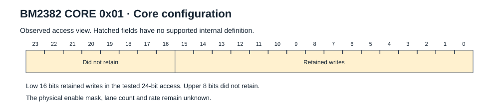
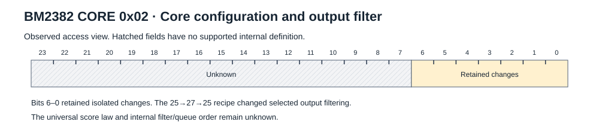
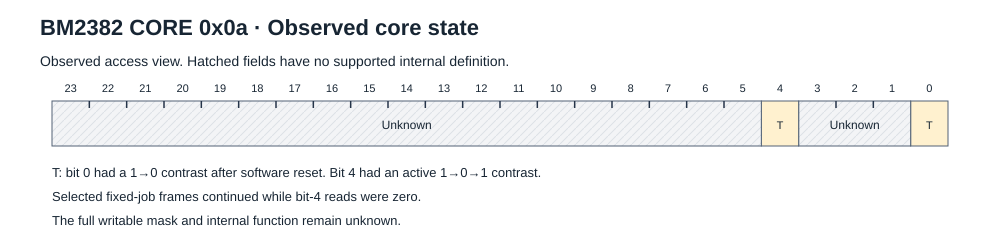
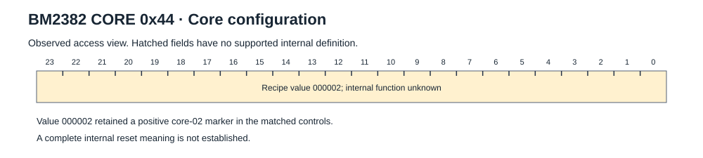

# BM2382 core registers

Core writes carry a 24-bit value, most significant byte first. The transport
has separate ASIC and core selector fields.

```text
55 aa 54 09 ASIC_SELECTOR CORE_REGISTER CORE_SELECTOR VALUE_BE[3] CRC5
```

Directed core access uses commands `44` and `45`. Readback has a core selector
and a 24-bit value. See the [directed core write](protocol.md#directed-core-write),
[directed core read](protocol.md#directed-core-read) and
[typed core response](protocol.md#typed-core-response) layouts.

Example: core register `01`, selector `ff`, value `005a5a`:

```text
55aa54090001ff005a5a12
```

## Register index

| Address | Description |
| --- | --- |
| [0x01](#0x01-core-configuration) | Core configuration |
| [0x02](#0x02-core-configuration-and-output-filter) | Core configuration and output filter |
| [0x0a](#0x0a-writable-core-state) | Writable core state |
| [0x44](#0x44-core-configuration) | Core configuration |

All entries are partially characterized. A recipe value is not a reset value.
Status `proven` applies to the stated observation, not the complete register.
The contrasts below used fixed work at the 300 MHz reference point on the
tapped chain 2. Recipe writes and measured readback are separate observations.
See the [measured state sequence](registers.md#measured-state-sequence) for
no-work, work and software-reset responses.

## 0x01 Core configuration

**Access:** Observed read/write comparisons; use the tested selector scope.

**Startup write:** `005a5a`.

**Measured readback:** `000000` after the tested setup-plus-work sequence.
Later directed writes retained the low 16-bit candidates.



**Tested behaviour:** Low 16 bits retained writes; the upper 8 bits did not retain in the tested 24-bit access. Values 5a5a, ffff and ffffff retained output. ASIC software reset mode 1 cleared a positive marker.

**Reset and restoration:** ASIC software-reset mode 1 cleared a positive marker in the matched tests.

**Unknown:** Physical enable mask, lane count and rate.

**Stock recipe example:** initializer row 96. Preserve its phase and selector scope.

```text
55aa54090001ff005a5a12
```

[Field metadata](images/register-core-01.json) · [Observation evidence](evidence/register-observations.json)

## 0x02 Core configuration and output filter

**Access:** Observed read/write comparisons; use the tested selector scope.

**Recipe writes:** `00007f` during startup; `000025` for mining.

**Measured readback:** `000025` during work; `000013` after the tested ASIC
software-reset modes 1 and 3.



**Tested behaviour:** Bits 0–6 retained isolated changes. ASIC reset modes
1 and 3 changed selected positive markers to `000013`. Core register `44`
value 2 retained the selected `02` marker. The `25→27→25` test excluded
score-38 opportunities while higher-score output continued. See the
[filter contrast](research-notes.md#output-filter-contrast) for its scope.

**Reset and restoration:** ASIC software-reset modes 1 and 3 returned the
selected markers to `000013`, not zero. Core register `44` value 2 retained
the selected marker.

**Unknown:** Universal score law and internal filter/queue order.

**Stock recipe example:** initializer row 97. Preserve its phase and selector scope.

```text
55aa54090002ff00007f1f
```

[Field metadata](images/register-core-02.json) · [Observation evidence](evidence/register-observations.json)

## 0x0a Writable core state

**Access:** Observed read/write comparisons; use the tested selector scope.

**Observed values:** `000000`, `000001` after the tested ASIC reset, and
`000010` during later active fixed-job tests.



**Tested behaviour:** After ASIC software reset, a directed `000001→000000`
write gave three equal readbacks on each selected ASIC. Sibling and other-chip
state remained unchanged. A matched stock mode 1 reset restored `000001`.

In later active tests, bit 4 read `000010→000000→000010`. The selected target
frame families continued while bracketing reads were zero. Sibling and
other-chip controls retained `000010`; core `02` retained `000025`.
Reassertion followed the original work phase rather than time since the clear.
These observations do not establish an overflow trigger or saturation law.

**Reset and restoration:** A matched stock reset restored the observed value 000001. This does not establish all reset states.

**Unknown:** Full writable mask, bit 4 trigger, overflow and saturation law.
The firmware label is not proof. See [research notes](research-notes.md).

**Stock recipe example:** initializer row 101. Preserve its phase and selector scope.

```text
55aa5409000aff0000001f
```

[Field metadata](images/register-core-0a.json) · [Observation evidence](evidence/register-observations.json)

## 0x44 Core configuration

**Access:** Observed read/write comparisons; use the tested selector scope.

**Tested write:** `000002`.

**Measured readback:** `000000` in the stated work and ASIC-reset sequence.
The recipe write is not a demonstrated retained value of 2.



**Tested behaviour:** Value 2 retained a positive core-02 marker in the isolated matched controls.

**Reset and restoration:** Value 000002 retained the selected positive core-02 marker. Other reset behaviour is unknown.

**Unknown:** Complete internal reset meaning.

[Field metadata](images/register-core-44.json) · [Observation evidence](evidence/register-observations.json)

## Selector and ownership limits

Selectors 0–125 replied in the tested access. Selectors 126 and 127 did not.
This establishes a tested access range. It does not prove 126 physical engines.

The low seven bits of the last nonce byte form a core-coordinate view. Other
nonce bits form a chip-coordinate view. These fields overlap the nonce.
They do not establish a unique physical owner for each returned result.

The words “core enable” and “nonce overflow” occur in recovered firmware.
They are `hypothesis` labels for internal function. Use the observed access
and effect statements above when implementing a driver.

## Supported use

Preserve the complete [initializer](initialization.md). Use `02=25` for the
tested mining recipe. Always calculate PoW on the host. A hardware qualifier
or a core-register setting does not establish pool-target validity.

[BM2382 overview](README.md) · [Evidence](evidence.md) · [Unknowns](unknowns.md)
