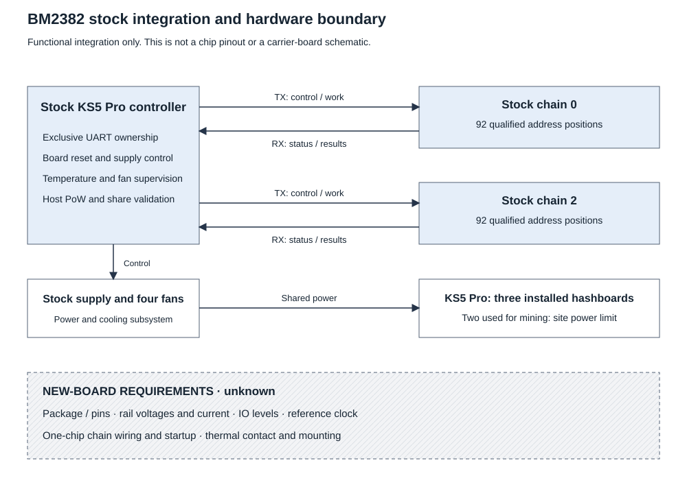

# BM2382 hardware interface

The tested device is a stock Antminer KS5 Pro. Controller configuration and UART
identity use BM2382 and family value `2382`. The physical package marking and
a complete manufacturer pinout are not confirmed.

## Stock-board knowledge

[Stock integration](stock-integration.md) gives the controller resource map,
supply sequence, reset levels, UART paths and cooling interfaces.

| Item | Status | Evidence and scope |
| --- | --- | --- |
| TXD and RXD | `proven` | Separate UART directions on the tapped controller-to-board cable |
| Reset | `proven` | Board reset under the tested stock controller integration |
| Presence signal | `proven` | Board presence observed on the stock cable |
| Address inventory | `proven` | 92 positions per tested chain; selectors 00–b6 in steps of 2 |
| Power and fan control | `proven` | Stock supply and four-fan control used during mining and recovery |
| 46 domains, two positions per domain | `proven` configuration | Controller topology values; not an independently measured rail map |

The KS5 Pro has three installed hashboards. We used two for mining because
of the test site's power limit. These were controller chains 0 and 2, with
92 address positions on each chain. The third hashboard remained connected
to the shared supply but was not used for mining. Whole-miner power readings
include the shared supply and connected hardware. A data-presence signal does
not measure whether a board has supply power.

The two-hashboard test setup is a site constraint. The documented driver was
validated in that setup. Operation with all three hashboards remains untested.

Cable signals and controller GPIOs are not chip package pins. An oscilloscope
or multimeter at the cable cannot by itself establish the complete chip pinout.

## New-board requirements

These facts remain `unknown` for BM2382:

1. Package dimensions, pin-1 orientation, land pattern and thermal pad.
2. Pin-to-net assignment, including supplies, ground, serial chain and reset.
3. Rail voltages, current, sequence and decoupling requirements.
4. IO voltage levels, drive/loading requirements and reference clock.
5. Supported one-chip startup and chain wiring.
6. Thermal contact, mounting and cooling requirements on a new board.

A carrier design must establish these before fabrication or powered testing.
Use an applicable authenticated specification, or measure and verify the
stock board. Record the method, board identity, values and uncertainty.

## Limits

No manufacturer absolute voltage, current or temperature ratings are supplied
here. The stock controller thresholds are not chip ratings. Whole-miner wall
power cannot establish one-chip power. A timing-derived effective hash clock
cannot establish a reference-clock pin or oscillator frequency. Terminal GPIO
readback confirms controller outputs. It does not measure chip rail collapse.

Do not import BM1366 or BM1397 rails, pins, clock values or footprints.
Those chips are separate families. [Unknowns](unknowns.md) distinguishes
carrier blockers from optional internal research.

[BM2382 overview](README.md) · [Evidence](evidence.md) · [Unknowns](unknowns.md)
