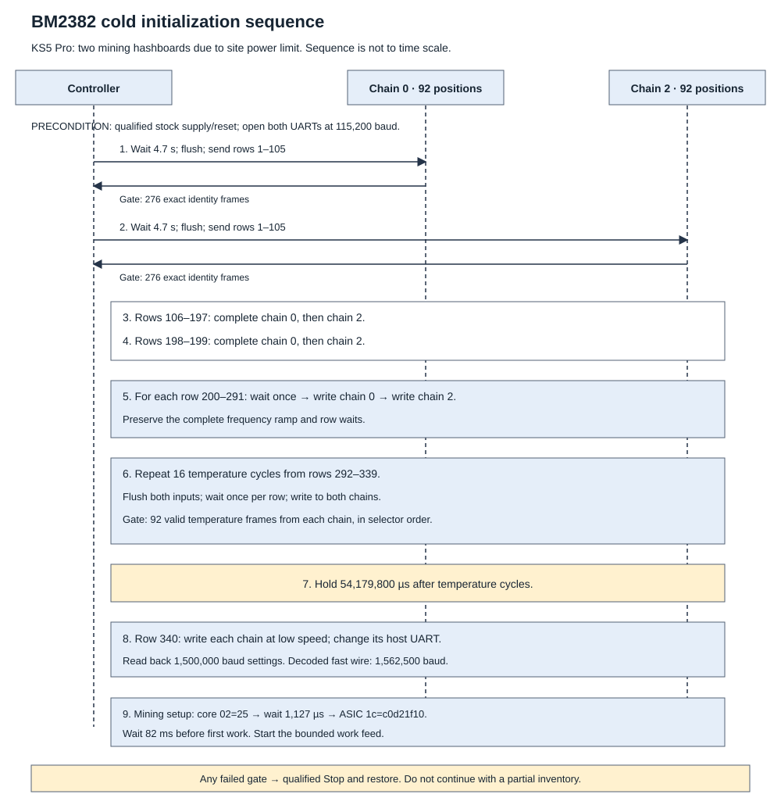

# BM2382 initialization

This is the supported cold-start recipe for the tested stock KS5 Pro controller
and chains 0 and 2. Each chain has 92 address positions. A one-chip board or
another chain length requires new qualification.

The KS5 Pro has three hashboards. We tested two because of the site power
limit. This sequence preserves the tested configuration. It is not a
requirement that a BM2382 miner have two hashboards.

The [340-row sequence](evidence/initialization.tsv) contains the exact packets
and waits. The [276-frame response fixture](evidence/address-responses.hex)
contains the required identity responses for each chain. Do not treat the
sequence as a list that can be sent once to each board without coordination.

## Preconditions

1. Establish exclusive control of the stock UART, supply, reset and fan roles.
2. Start the power, cooling and execution watchdogs. Define a finite run bound.
3. Disable ASIC power. Wait at least 61 s and validate supply discharge.
   Complete the stock APW17 setup. Enable power, wait 1 s and validate supply
   feedback. Use the complete [stock integration recipe](stock-integration.md).
4. Apply the stock board reset/release sequence. Use the GPIO schedule in
   [stock integration](stock-integration.md).
5. Open both UARTs in raw 115,200 baud, 8N1 mode. Read back the host settings.

The chip package pinout, chip rails and chip-level reset timing are unknown.
The stock-controller GPIO schedule is known. It is not a chip timing rating.
These preconditions refer to the existing KS5 Pro integration. The UART fixture
alone cannot bring up a newly designed board.

## Replay order

A row wait occurs before its packet unless the step below says otherwise.
Use microseconds for `delay_us`. Keep timing-sensitive execution local to the
controller. Preserve this ordering across the two UARTs.

1. For chain 0, wait 4,700,000 µs after reset, flush the input and send rows 1–105.
   Read and validate all 276 identity frames. Repeat this step for chain 2.
2. Send rows 106–197 to chain 0. Then send the same rows to chain 2.
   These are the 92 per-selector software-reset writes.
3. Send rows 198–199 to chain 0. Then send the same rows to chain 2.
4. For each row 200–291, wait once. Send that row to chain 0, then to chain 2.
   These rows contain the frequency ramp.
5. Execute 16 temperature cycles from rows 292–339. Flush both inputs at the
   start of each cycle. For each of its three rows, wait once and write to both
   chains. Read 92 valid temperature frames from each chain before proceeding.
6. Wait 54,179,800 µs after the temperature cycles. The cycle waits plus this
   hold give a nominal 70,000,000 µs between the final ramp word and fast UART.
7. Send row 340 to each chain at low speed. Configure that host UART for
   1,500,000 baud and read back the host settings. The captured wire decodes
   at 1,562,500 baud.
8. Send core `02=25` to chain 0, then chain 2. Wait 1,127 µs. Send ASIC
   `1c=c0d21f10` to chain 0, then chain 2. Start the supported work feed at
   its first dispatch deadline. The runtime sets that deadline to 82 ms after
   the job-processing time sampled before these setup writes. This is a
   scheduler offset, not an 82 ms minimum wait after the last write.

Do not remove ramp words or waits because a final register value looks equal.
The complete sequence is the qualified recipe.

## Response gates

For each chain, the address gate expects three groups of 92 frames:

| Group | Value and selector |
| --- | --- |
| First | `23820000`, selector `00`, repeated 92 times |
| Second | `238200ss`, selectors `00,02,…,b6` |
| Third | `238200ss`, selectors `00,02,…,b6` |

Require exact order, valid CRC5 and the expected register echo. Temperature
gates also require value bit 31, value bits 16–23 equal to zero, selectors
00–b6 in order, register c4 and converted values from 0 to 100 °C. This range
is an implementation admission check, not an ASIC temperature rating.
The response fixture is in wire order. Use a 5 s address-response timeout and a 2 s
complete-temperature-response timeout in this implementation. These are
controller bounds, not chip timing ratings.

Fail startup if a response gate fails. Use the qualified stop/restore path.
Do not continue with a partial chain inventory.

## Checkpoints

| Checkpoint | Packet or value |
| --- | --- |
| Initial identity poll | `55aa520500000a` |
| First address | `55aa400500001c` |
| Startup core word | `01=005a5a` |
| Startup core-02 | `00007f` |
| Work/result lengths | `50=0000002f`, `54=00000007` |
| Startup operating word | `1c=c0c21f10` |
| Final ramp word | `08=d0c80211` |
| Fast UART | `55aa510900600000010015` |
| Mining core-02 | `000025` |
| Mining operating word | `1c=c0d21f10` |

## Evidence and limits

The supported Rust controller used this recipe for fresh-job mining and
recovery. [Evidence](evidence.md) records those results and their failures.
The initializer is reproducible data, not a complete explanation of silicon
startup. Power, reset, cooling and UART ownership remain required.

[BM2382 overview](README.md) · [Evidence](evidence.md) · [Unknowns](unknowns.md)
