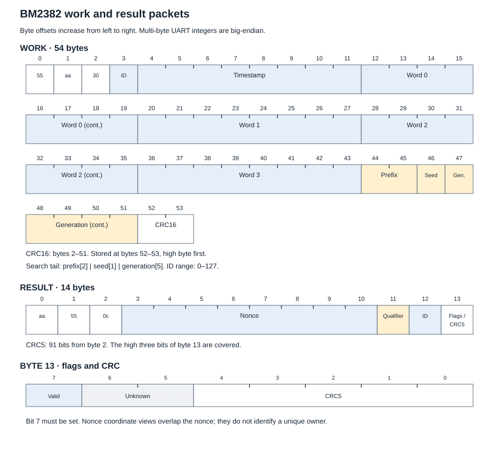

# BM2382 mining data flow

Use the [captured share example](evidence/mining-example.json) to check byte
order, packet encoding and PoW. Its original job, packet, result and digest
values are preserved. The worker label is replaced with `example.worker`.



## Build work

The supported pool adapter takes a job token, four 64-bit pre-PoW words,
a 64-bit timestamp, a two-byte prefix and a positive integer difficulty.
Keep these values together with the current pool session.

The 54-byte UART packet is:

```text
55 aa 30 ID TIME_BE[8] WORD0_BE[8] WORD1_BE[8] WORD2_BE[8] WORD3_BE[8]
PREFIX[2] SEED[1] GENERATION_BE[5] CRC16_BE[2]
```

`ID` is 0–127. `SEED = (2 * (ID + 1)) & 255`. The generation has 40 bits.
The stock historical capture used generation zero. The supported production
profile uses two generation windows, zero and `2^39`, with at most 256 packets
per job across both chains. Packet ordinals 1–128 use generation zero.
Ordinals 129–256 use `2^39`. Each window contains 64 two-chain pairs.
This is a controller search policy, not a chip lifetime limit.

The tested KS5 Pro used two mining hashboards because of the site power
limit. Its two-chain dispatch allocates an even base ID to chain 0 and base+1 to
chain 2. The base advances by 2 and wraps within the seven-bit ID space. Keep the
base ID across job changes. A new job resets the packet ordinal, recent
dispatch records and candidate state; it does not reset the base ID.
The tested pair cadence is 81 ms. The same chain ID returns after 64 pairs:
5.184 s at this cadence. The 2 s result-age bound is shorter than this interval.
Do not infer maximum ASIC throughput from the cadence.

After 128 pairs, stop dispatch for that job. Do not repeat the search windows.
A new selected job enables dispatch again. At regular cadence, the finite
packet budget covers approximately 10.3 s. A repeated current-job notification
refreshes the job-silence timer; it does not reset the search budget.

Calculate CRC16 over bytes 2–51. Send the high CRC byte first.
See [protocol](protocol.md#work-packet) for offsets and checksum parameters.

## Bind and validate a result

1. Require a complete 14-byte result frame, correct preamble and count,
   a valid CRC5 over 91 bits from byte 2, and the final-byte bit-7 result flag.
2. Use the UART chain and returned work ID to find a recent dispatch.
   Require the current job and session. A work ID alone is not sufficient.
3. Require the returned nonce prefix and seed to match the dispatch.
   The prefix is nonce bytes 0–1; the seed is nonce byte 2.
4. Reject expired candidates. The tested implementation uses a 2 s age bound.
5. Interpret bytes 3–10 of the frame as one big-endian unsigned 64-bit nonce.
   Calculate the complete Kaspa PoW on the host.
6. Compare the digest integer with the applicable target. Accept equality:
   `digest_integer <= target_integer`.
7. Deduplicate by nonce within the job. Keep the deduplication entry after
   a successful pool response. Submit only target-valid, current candidates.

The qualifier byte and chip/core coordinate views are diagnostics. They do
not replace PoW calculation or establish a unique physical output owner.

## Byte order for host PoW

UART byte order differs from hash-input byte order.

| Item | UART | Host PoW input |
| --- | --- | --- |
| Four pre-PoW words | Each word big-endian | Each word little-endian |
| Timestamp | Big-endian | Little-endian |
| Returned nonce | Big-endian | Decode the integer, then use little-endian |

Construct the 80-byte first hash input:

```text
PRE_POW_HASH_LE[32] | TIMESTAMP_LE[8] | ZERO[32] | NONCE_LE[8]
```

Use the Kaspa `kHeavyHash` algorithm. Generate the matrix once for each
pre-PoW hash. Reuse it for candidate checks for that job. Use the cSHAKE256
domains `ProofOfWorkHash` and `HeavyHash`. Do not replace them with SHA-256.
Interpret the resulting 32-byte digest as a little-endian integer.

Use the pinned Kaspa implementation for the [PoW sequence](https://github.com/kaspanet/rusty-kaspa/blob/01b532e8b553523216471682649693af92f0fd16/consensus/pow/src/lib.rs),
[matrix generation and transform](https://github.com/kaspanet/rusty-kaspa/blob/01b532e8b553523216471682649693af92f0fd16/consensus/pow/src/matrix.rs)
and [hash domains](https://github.com/kaspanet/rusty-kaspa/blob/01b532e8b553523216471682649693af92f0fd16/crypto/hashes/src/pow_hashers.rs).

## Target rule

The supported pool adapter uses this difficulty-one integer, shown big-endian:

```text
00000000ffff0000000000000000000000000000000000000000000000000000
```

For a positive integer difficulty `d`, use `floor(difficulty_one_target / d)`.
This describes this adapter. Other pool protocols need their own target checks.
Never treat a local filter score as a pool target.

## Worked physical example

| Field | Value |
| --- | --- |
| Job token | `0000cad0` |
| Timestamp | `1790842394602` |
| Difficulty | `32768` |
| Work ID | `39` |
| Nonce | `07905024b2fce646` |
| Digest | `af7e033aeca889ee4533c6ab9fb9b21d8ca8817cc02c6c7150be010000000000` |
| Target, big-endian | `000000000001fffe000000000000000000000000000000000000000000000000` |
| Pool response | Accepted, request ID `4` |

Work frame:

```text
55aa3027000001a0f68657eae5351f199792f613a81ec49f4dfa98eb23aaae123e591743da7d89eb7634a8f507905000000000009e0f
```

Result frame:

```text
aa550c07905024b2fce6462f279e
```

The static JSON contains the four original job words and all replay inputs.
The production Rust verifier reproduced this digest and the target decision.
A captured nonce, software-valid PoW and a pool acceptance are separate
observations. This example has all three.

## Replace jobs and handle failures

A new job retires old unsubmitted candidates. Reset the per-job deduplication
set. Keep already submitted requests until their responses are accounted for;
use request IDs to bind those responses to the original job.

The tested implementation permits eight pending submissions, a 350 ms submit
budget including PoW, a 5 s response/I/O timeout and 30 s setup/job-silence
bounds. It also has a four-hour session limit. These are software policies.
They are not BM2382 timing guarantees or physical endurance results.
Search-budget exhaustion and the job-silence fault are separate conditions.

A fatal pool disconnect must stop work and enter a safe terminal state.
A fresh owner must perform full cold initialization. See [operation](operation.md).

[BM2382 overview](README.md) · [Evidence](evidence.md) · [Unknowns](unknowns.md)
