# BM2382 Protocol

This page describes the UART protocol between a Bitmain Antminer KS5 Pro controller
and its BM2382 hashboards. Each hashboard has a separate UART.
The supported controller coordinates
work and initialization across both tested chains.

All offsets are zero-based byte offsets. All hexadecimal byte strings are in
wire order.

## Serial interface

The interface has separate transmit and receive signals.

| Direction | Preamble | Meaning |
| --- | --- | --- |
| Controller to hashboard | `55 aa` | Control, register, and work packets |
| Hashboard to controller | `aa 55` | Status and result packets |

The captured traffic decodes as 8N1 at two UART speeds. The large population
of valid frames strongly supports this format.

| Phase | Speed | Format |
| --- | ---: | --- |
| Startup | 115,200 baud | 8 data bits, no parity, 1 stop bit |
| Mining | Host setting 1,500,000 baud; decoded wire 1,562,500 baud | 8 data bits, no parity, 1 stop bit |

The controller sends the fast UART configuration at 115,200 baud. It then
changes the host UART to 1,500,000 baud.

## Packet families

| Direction | Header | Length | Function | Integrity |
| --- | --- | ---: | --- | --- |
| Downstream | `55 aa 30` | 54 bytes | Mining work | CRC16-CCITT/FALSE |
| Downstream | `55 aa 40` | 7 bytes | ASIC address assignment | Bitmain CRC5 |
| Downstream | `55 aa 41` | 11 bytes | Directed ASIC register write | Bitmain CRC5 |
| Downstream | `55 aa 42` | 7 bytes | Directed ASIC register read | Bitmain CRC5 |
| Downstream | `55 aa 44` | 11 bytes | Directed core register write | Bitmain CRC5 |
| Downstream | `55 aa 45` | 8 bytes | Directed core register read | Bitmain CRC5 |
| Downstream | `55 aa 51` | 11 bytes | Flagged ASIC register write | Bitmain CRC5 |
| Downstream | `55 aa 52` | 7 bytes | Status or register poll | Bitmain CRC5 |
| Downstream | `55 aa 53` | 7 bytes | Firmware-linked inactive setup | Bitmain CRC5 |
| Downstream | `55 aa 54` | 11 bytes | Core register write | Bitmain CRC5 |
| Upstream | `aa 55 08` | 10 bytes | ASIC status or typed core response | Bitmain CRC5 |
| Upstream | `aa 55 0c` | 14 bytes | Nonce or result | Bitmain CRC5 |

## Integrity checks

### Work CRC16

Work packets use CRC16-CCITT/FALSE.

| Parameter | Value |
| --- | --- |
| Initial value | `0xffff` |
| Polynomial | `0x1021` |
| Input reflection | No |
| Output reflection | No |
| Final XOR | `0x0000` |
| Covered bytes | Packet offsets `0x02` to `0x33` |
| Stored value | Packet offsets `0x34` and `0x35`, most significant byte first |

A synthetic work packet with command `0x30`, work ID `0`, and 48 zero payload
bytes has CRC16 `0x0ece`.

### Bitmain CRC5

Control, status, and result packets use the same five-bit CRC process.

| Parameter | Value |
| --- | --- |
| Initial value | `0x1f` |
| Polynomial | `0x05`, which represents `x^5 + x^2 + 1` |
| Bit order | Most significant bit first |
| Final XOR | None |
| Stored value | Low five bits of the final packet byte |

The CRC5 state update is:

```text
crc = 0x1f
for each input bit, most significant bit first:
    feedback = ((crc >> 4) & 1) XOR input_bit
    crc = (crc << 1) & 0x1f
    if feedback is 1:
        crc = crc XOR 0x05
return crc
```

For a downstream control packet, start at the command byte. Stop before the
final CRC byte.

For an upstream packet, start at the count byte. Include the high three bits of
the final packet byte. These three bits can contain status flags.

Validated CRC5 examples:

| Packet | Calculated CRC5 |
| --- | ---: |
| `55 aa 40 05 00 00 1c` | `0x1c` |
| `55 aa 52 05 00 00 0a` | `0x0a` |
| `55 aa 51 09 00 60 00 00 01 00 15` | `0x15` |
| `aa 55 08 23 82 00 00 00 00 17` | `0x17` |

## Downstream control frame

The generic control frame has this format:

```text
55 aa <transport_header> <count> <payload> <crc5_and_flags>
```

The total packet length is `count + 2` bytes. The payload length is
`count - 3` bytes.

The controller builds the transport header with this rule:

```text
transport_header = 0x40 | (message_flag << 4) | operation
```

| Header bits | Function |
| --- | --- |
| `0..3` | Operation |
| `4` | Message flag |
| `5..7` | Class value `2` in all observed packets |

The observed command families are:

| Header | Operation | Flag | Function |
| --- | ---: | ---: | --- |
| `0x40` | `0` | `0` | Assign an ASIC selector |
| `0x41` | `1` | `0` | Write a selected ASIC register |
| `0x42` | `2` | `0` | Read a selected ASIC register |
| `0x44` | `4` | `0` | Write a selected core register |
| `0x45` | `5` | `0` | Read a selected core register |
| `0x51` | `1` | `1` | Write an ASIC register with the message flag set |
| `0x52` | `2` | `1` | Poll a status or register value |
| `0x53` | `3` | `1` | Firmware maps this to inactive setup before addressing |
| `0x54` | `4` | `1` | Write a core register |

The command-bit split is proven in the controller transport. Directed requests
selected the requested target in the matched tests. The stock flagged requests
reached the documented chain inventory. These observations do not establish
the internal meaning of every flag or class bit.

## Address assignment

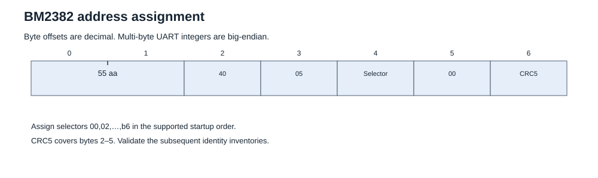

Address assignment uses a 7-byte `0x40` packet.

```text
55 aa 40 05 <selector> 00 <crc5>
```

The tested chain received 92 packets. The selector started at `0x00` and
increased by 2. The last selector was `0xb6`.

Example for the first ASIC position:

```text
55 aa 40 05 00 00 1c
```

The selector interval is also present as the value `2` in the controller
configuration.

## ASIC register write

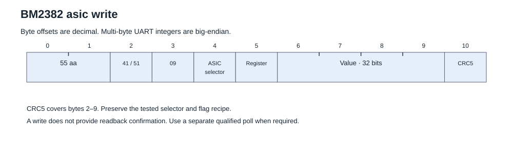

The payload is an ASIC selector, register address and 32-bit value.
Use header `41` or `51` only with its tested selector scope. A write does not
provide readback confirmation. Use a separate qualified poll when required.
See the [ASIC register index](registers.md#register-index).

Stock example: set work-length register `50` to `0000002f`:

```text
55aa510900500000002f18
```

## Core register write

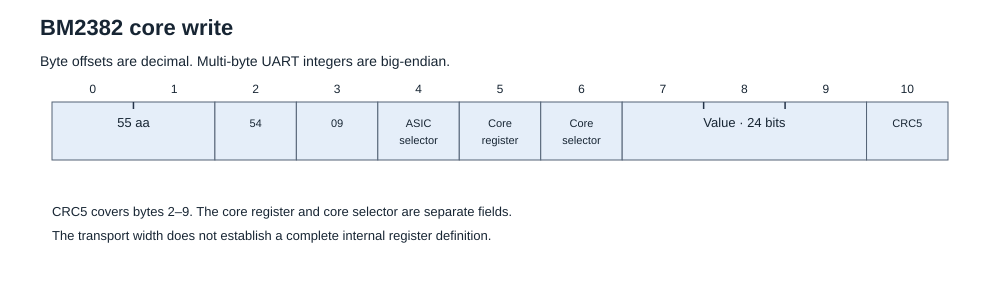

The payload has separate ASIC selector, core register and core selector fields.
Header `44` selects the directed form. Header `54` is the stock flagged form.
The value is 24 bits. The stock recipe uses core selector `ff` for these setup
writes. Preserve that recipe; do not infer arbitrary selector semantics.
See the [core register index](core-registers.md#register-index).

Stock example: core register `01`, selector `ff`, value `005a5a`:

```text
55aa54090001ff005a5a12
```

## Register poll

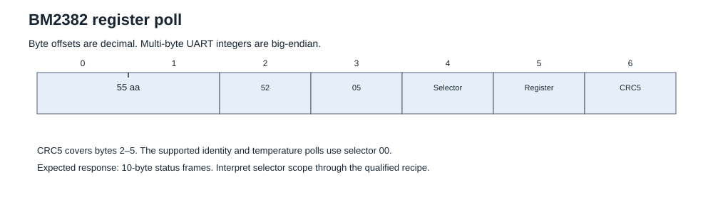

The documented identity and temperature polls use header `52`, selector `00`
and the required register address. Expected responses are 10-byte status frames.
Validate their CRC, selector, register and value before using them. Response
counts depend on the poll and startup phase. See [enumeration](procedures.md#enumerate-the-assigned-chips)
and [temperature access](procedures.md#read-temperature).

Diagnostic polling is state-sensitive. Register `3c` reads can affect the
output/count relationship. Use its [bounded research policy](research-notes.md#counters-and-read-effects).

## Directed register access

### Directed ASIC read

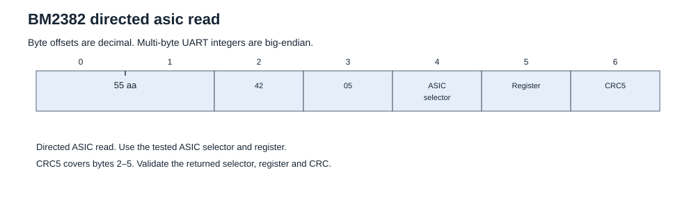

Directed ASIC reads use this 7-byte frame:

```text
55 aa 42 05 ASIC_SELECTOR REGISTER CRC5
```

Captured example: read ASIC register `00` at selector `4a`:

```text
55aa42054a000e
```

Require one qualified ASIC status response for the requested selector and
register. Its value is 32 bits, most significant byte first, at bytes 3–6.
The matched ASIC responses have zero high bits in the final byte.
A missing response is not a zero value.

### Directed core read

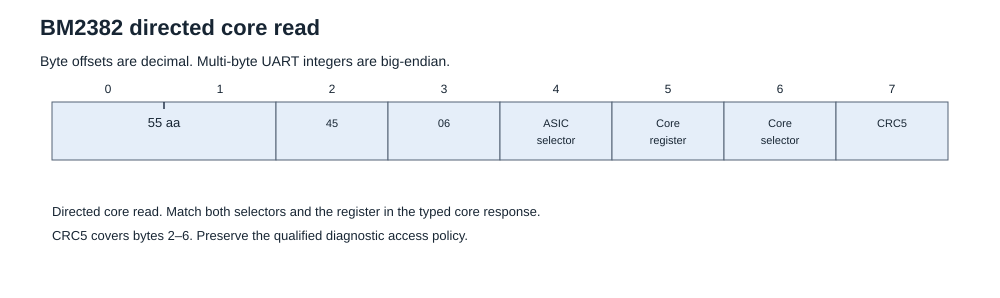

Directed core reads use this 8-byte frame:

```text
55 aa 45 06 ASIC_SELECTOR CORE_REGISTER CORE_SELECTOR CRC5
```

Encoding example: read core register `02`, core selector `00`, ASIC selector
`4a`:

```text
55aa45064a020019
```

### Directed core write

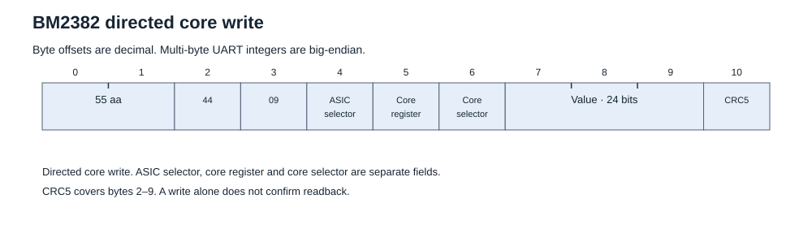

Directed core writes use the same payload layout as the stock core write.
Change the header to `44` and calculate a new CRC5.

Encoding example: write `000025` to the same core register and selectors:

```text
55aa44094a02000000250c
```

These encoding examples define packet construction. They do not authorize a
write in an arbitrary operating state. The retained tests used selected
registers, states and targets. Core selectors 0–125 responded in the tested
state; selectors 126 and 127 were silent. This does not prove a physical
engine count. Use [directed readback](procedures.md#read-a-selected-register)
and preserve the documented [read-effect limits](research-notes.md#counters-and-read-effects).

## Typed core response

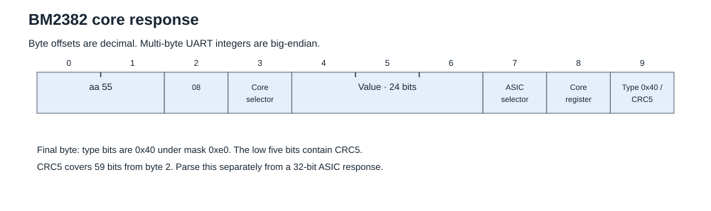

Core reads return a 10-byte status frame with a different value layout:

```text
aa 55 08 CORE_SELECTOR VALUE_BE[3] ASIC_SELECTOR CORE_REGISTER FLAGS_CRC5
```

| Offset | Size | Field |
| ---: | ---: | --- |
| 3 | 1 | Requested core selector |
| 4–6 | 3 | Core value, most significant byte first |
| 7 | 1 | Requested ASIC selector |
| 8 | 1 | Requested core register |
| 9 | 1 | High type flags and low five CRC5 bits |

The matched core responses have high flag bits `40`. Validate these flags,
both selectors, the register and the CRC5 over 59 bits from byte 2.
Do not parse byte 3 as the high byte of the core value.

Captured response: ASIC selector `4a`, core selector `00`, core register
`02`, value `000025`:

```text
aa5508000000254a0248
```

The final byte is `48`: type flags `40` and CRC5 `08`. These are observed
external response fields. Their complete internal silicon meaning is unknown.

## Inactive setup

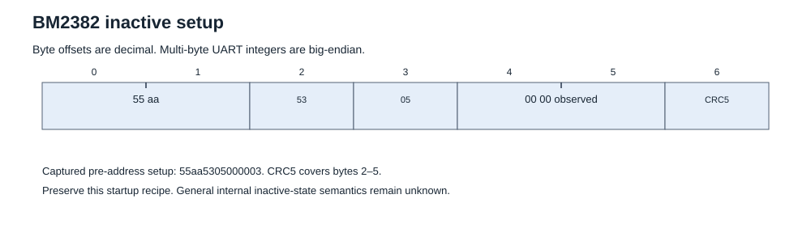

The captured pre-address packet is:

```text
55aa5305000003
```

Preserve its position in the [initializer](initialization.md#replay-order).
The complete internal inactive-state behaviour is unknown. The supported
initializer proceeds through the subsequent identity-response gates.

## Work packet

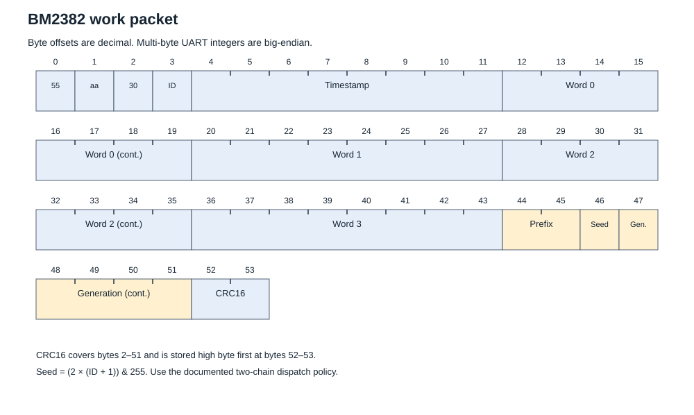

The downstream work packet has a fixed length of 54 bytes.

```text
55 aa 30 <work_id> <work_image[48]> <crc16_be[2]>
```

| Offset | Size | Field | Status |
| ---: | ---: | --- | --- |
| `0x00` | 1 | Preamble `0x55` | Proven |
| `0x01` | 1 | Preamble `0xaa` | Proven |
| `0x02` | 1 | Work command `0x30` | Proven |
| `0x03` | 1 | 7-bit work identifier | Proven |
| `0x04..0x0b` | 8 | Timestamp, big-endian | Controller and capture agree |
| `0x0c..0x2b` | 32 | Four pre-PoW words, each big-endian | Controller and capture agree |
| `0x2c..0x33` | 8 | Prefix, seed, and generation search tail | Controller construction known |
| `0x34..0x35` | 2 | CRC16, most significant byte first | Proven |

The work identifier is masked with `0x7f`. It has the range `0` to `127` and
wraps after `127`.

The work identifier is not globally unique. A controller must also keep the
current cache generation and timing context.

The complete 48-byte work image is sent to the ASICs and cached by work
identifier. The host result check loads only the first 40 bytes before its
`kHeavyHash` calculation. It does not load bytes `0x2c` to `0x33`.

The current controller profile builds the final eight bytes as follows:

| Work-image offset | Size | Field |
| ---: | ---: | --- |
| `0x28..0x29` | 2 | Extranonce prefix |
| `0x2a` | 1 | Work seed `(2 * (work_id + 1)) & 0xff` |
| `0x2b..0x2f` | 5 | 40-bit generation, big-endian |

The primary capture used this pattern:

| Offset | Observed value |
| ---: | --- |
| `0x2c` | Constant `0x07` |
| `0x2d` | Constant `0x80` |
| `0x2e` | Variable |
| `0x2f..0x33` | Constant zero |

The captured packets used generation zero. The prefix was `07 80`. The variable
byte was the work seed.

The complete tail goes to the ASIC. The transmitted tail is not concatenated
to the host PoW input. The returned nonce is included in full. The tail is a search assignment. Selected seed, prefix and generation contrasts
have a predictive model; see [research notes](research-notes.md). This does not
establish the complete internal use of every bit.

## Upstream frame

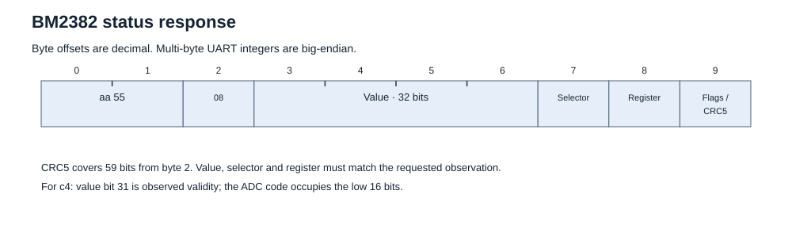

The generic upstream frame has this format:

```text
aa 55 <count> <payload> <flags_and_crc5>
```

The total packet length is `count + 2` bytes. The payload length is
`count - 2` bytes.

## BM2382 identity response

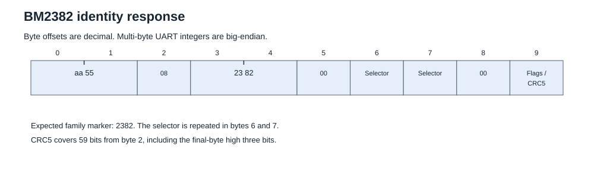

The low-speed zero-register poll is:

```text
55 aa 52 05 00 00 0a
```

The hashboard returns one or more responses with this shape:

```text
aa 55 08 23 82 00 <selector> <selector> 00 <crc5>
```

| Response field | Meaning | Status |
| --- | --- | --- |
| `23 82` | BM2382 family marker | Proven wire value |
| First selector | Address selector echo | Proven |
| Repeated selector | Repeated address selector echo | Proven |
| Final payload byte `00` | Zero-register echo | Strongly indicated |

The controller uses this exchange before address assignment and during later
startup checks.

Captured selector responses used even selector values from `0x02` through
`0xb6`. A separate zero response used selector `0x00`.

## Temperature response


The normal temperature poll is:

```text
55 aa 52 05 00 c4 17
```

The response has this format:

```text
aa 55 08 <flags> 00 <adc_msb> <adc_lsb> <selector> c4 <crc5>
```

| Offset | Size | Field |
| ---: | ---: | --- |
| `0x00..0x02` | 3 | Preamble and count `aa 55 08` |
| `0x03` | 1 | Status flags |
| `0x04` | 1 | Reserved value `00` in the matched responses |
| `0x05..0x06` | 2 | Sensor ADC code, most significant byte first |
| `0x07` | 1 | Chain or ASIC selector echo |
| `0x08` | 1 | Register echo `c4` |
| `0x09` | 1 | High status bits and CRC5 |

The tested firmware converts the ADC code with this formula:

```text
temperature_c = ((adc_code - 0.5) * 662.88 / 4096.0) - 287.48
```

The controller calculates the index as `selector >> 1`. The tested address
interval is 2.

The stock conversion produced 66.536 to 87.089 degrees Celsius during the
mining part of the primary capture. These are captured observations. They are
not BM2382 temperature ratings.

In the primary capture, 279 polls had a matching response before the next
control packet. All 279 responses arrived within 2 milliseconds. The median
response time was approximately 59.55 microseconds.

## Result packet

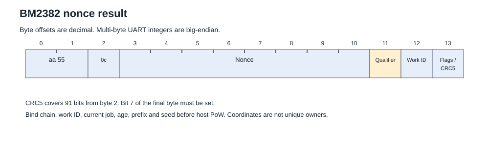

The upstream result packet has a fixed length of 14 bytes.

```text
aa 55 0c <result_payload[10]> <flags_and_crc5>
```

| Offset | Size | Field | Status |
| ---: | ---: | --- | --- |
| `0x00..0x02` | 3 | Preamble and count `aa 55 0c` | Proven |
| `0x03..0x0a` | 8 | Raw returned value | Firmware and capture agree |
| `0x03..0x04` | 2 | Observed constant `07 80` | Proven for the tested capture |
| `0x06` | 1 | Controller chip-address input | Controller parser use confirmed |
| `0x0a & 0x7f` | 1 | Controller core identifier | Controller parser use confirmed |
| `0x0b` | 1 | Status or qualifier byte | Preserved by controller parser |
| `0x0c` | 1 | Returned work identifier | Controller parser use confirmed |
| `0x0d` bit 7 | 1 bit | Valid result flag | Controller parser use confirmed |
| `0x0d` bits 0 to 4 | 5 bits | CRC5 | Proven |

Some fields overlap. The parser uses individual bytes for chip and core
routing. The host check also treats offsets `0x03` to `0x0a` as one 8-byte
returned value.

Example captured result:

```text
aa 55 0c 07 80 04 32 c4 9b cc 96 25 01 91
```

These overlapping coordinates do not identify a unique physical output owner.

The controller model reads chip address input `0x32`, core identifier `0x16`,
qualifier `0x25`, and work identifier `1`. The valid flag is set. The CRC5 is
`0x11`.

The tested capture contained 13,747 CRC-valid result packets. Returned work
identifiers covered the complete range from `0` to `127`. The median first
result latency for the same work identifier was 13.115 milliseconds.

Observed result-field ranges:

| Field | Observation |
| --- | --- |
| Core identifier | `0` to `125` |
| Work identifier | `0` to `127` |
| Most common status values | `0x25`, `0x26`, `0x27`, `0x28`, and `0x29` |
| Other observed status values | `0x2a` to `0x32`, and `0x36` |

The controller uses the status byte. The exact BM2382 meaning of each status
value is not fully confirmed.

The current open controller does not use this byte in its PoW target decision.
It preserves the value for diagnostics. Result acceptance uses frame validity,
recent-work binding, the search assignment, and the calculated PoW value.

## Work and result association

The table below describes the recovered stock-controller cache. New drivers
must also enforce the current-job, age, prefix and seed checks in
[mining](mining.md#bind-and-validate-a-result). A work ID alone is insufficient.


The controller keeps a correlation cache for 128 work identifiers.

| Cached item | Size for each work identifier | Use |
| --- | ---: | --- |
| Primary work value | 8 bytes | Host answer record |
| Secondary work value | 8 bytes | Host answer record |
| Complete transmitted work image | 48 bytes | Work validation and association |
| Target selector | 1 byte | Host result threshold check |
| Local validation block | 32 bytes | Final host result check |

When a result arrives, the controller uses the returned work identifier to
select the cache entry. It combines the cached work data with the 8-byte
returned value. It then runs the Kaspa `kHeavyHash` check and the local target
checks.

## Observed startup sequence

This list records historical stock traffic. Use [initialization](initialization.md)
for the exact supported two-chain replay, waits and response gates.


The tested chain used this packet-level sequence:

1. Send `0x52` zero-register poll and receive BM2382 family responses.
2. Send one `0x53` packet from the firmware inactive-address setup path.
3. Send 92 `0x40` address packets with selectors `0x00` to `0xb6`.
4. Send another `0x52` zero-register poll and check the selector responses.
5. Send the captured core and ASIC setup writes. Internal names remain provisional.
6. Send a third `0x52` zero-register poll.
7. Start the temperature setup and polling sequence.
8. Send 92 per-ASIC soft-reset register writes.
9. Send 89 global PLL targets from 56.250 MHz to 625.000 MHz.
10. Send `55 aa 51 09 00 60 00 00 01 00 15` at 115,200 baud.
11. Change the host UART to 1,500,000 baud.
12. Send the first-work frequency control and additional control writes.
13. Send the first 54-byte work packet.
14. Receive result and temperature packets.

The observed fast UART configuration packet is not an unnamed constant. The
controller baud path selects register `0x60` and value `0x100` specifically for
the 1,500,000 baud case.

## Mining-time control cycle

Temperature service continues while the ASICs process work. The repeated
three-packet cycle is:

```text
55 aa 51 09 00 c0 11 00 00 00 1f
55 aa 51 09 00 c0 11 02 00 00 0a
55 aa 52 05 00 c4 17
```

The primary capture contained 279 cycles. The median time between the first
and second write was 10.113 milliseconds. The median time from the second
write to the poll was 10.120 milliseconds. The median complete cycle interval
was 1.001 seconds.

## Evidence coverage

These counts are from the historical primary capture, not the October 2026
fresh-job runs. [Evidence](evidence.md) separates these data sets.


| Evidence item | Result |
| --- | ---: |
| Work CRC16 | `3,227 / 3,227` valid |
| Downstream control CRC5 | `1,276 / 1,276` valid |
| High-speed status CRC5 | `24,196 / 24,196` valid |
| Low-speed status CRC5 | `1,747 / 1,748` valid |
| Result CRC5 | `13,747 / 13,747` valid |
| Address assignments | `92 / 92` valid |
| Named `0x51` packets | `655 / 655` |

One low-speed status packet failed CRC validation. Reject that frame. The
other validated frames support the framing model.

## Protocol limits

- The protocol is proven for the KS5 Pro BM2382 hashboard interface.
- The electrical voltage of the UART signals is not specified here.
- The controller construction of the 8-byte search tail is known. Its internal
  BM2382 bit-level use is not documented.
- The exact internal encoding of the fast UART value `0x100` is not confirmed.
- Do not transfer register meanings from BM13xx Bitcoin ASICs to BM2382.

## Related pages

- [Task procedures](procedures.md)
- [Editable diagrams](images/README.md)

- [BM2382 overview](README.md)
- [BM2382 register map](registers.md)
- [BM2382 mining data flow](mining.md)
- [BM2382 hardware interface](hardware.md)

## Exact example and implementation bounds

Use the [captured share example](evidence/mining-example.json) for work/result
association and byte-order checks. Control CRC5 covers `(count - 1) * 8` bits
from byte 2. Status CRC5 covers 59 bits; result CRC5 covers 91 bits, both from
byte 2. Reject truncated frames before checksum calculation.

The valid result flag is bit 7 of the final byte. Bits 6 and 5 remain unknown.
An ASIC register status value occupies bytes 3–6, most significant byte first.
A typed core response instead has its core selector at byte 3 and its 24-bit
value at bytes 4–6. Byte 7 is the ASIC selector; byte 8 is the register. The `c4` validity observation is value
bit 31; the ADC code occupies the low 16 bits. The conversion is stock-derived,
not an externally calibrated chip rating.
