# BM2382 ASIC registers

ASIC register access carries a 32-bit value, most significant byte first.
Core register access is separate. See [core registers](core-registers.md).

## Access

The captured flagged ASIC write has this form:

```text
55 aa 51 09 SELECTOR REGISTER VALUE_BE[4] CRC5
```

The unflagged write uses header `41`. A flagged poll uses header `52` and
count `05`. Use the tested access recipe for the intended selector scope.
Do not assume that every operation gives the flag the same internal meaning.
See [protocol](protocol.md#downstream-control-frame) for checksum coverage.

## Evidence terms

`proven` means that the stated observation was physically tested under the
stated conditions. It does not mean that the entire register is understood.
All 14 targets below have partial physical characterization. No target has a
complete manufacturer field definition or reset table.

Most register contrasts used the 300 MHz reference recipe on the tapped
chain 2. The selected ASICs were usually `4a` and `4c`. The stock startup
recipe ends at `08=d0c80211`. These are different test states. A measured
register effect does not qualify another clock setting.

A startup write is not necessarily the returned value. Each section separates
the recipe from measured readback where these values differ.

## Register index

| Address | Description |
| --- | --- |
| [0x00](#0x00-identity-and-selector-echo) | Identity and selector echo |
| [0x08](#0x08-frequency-recipe) | Frequency recipe |
| [0x0c](#0x0c-independent-configuration-word) | Independent configuration word |
| [0x1c](#0x1c-operating-word) | Operating word |
| [0x30](#0x30-configuration-word) | Configuration word |
| [0x3c](#0x3c-diagnostic-counter) | Diagnostic counter |
| [0x44](#0x44-software-reset-recipe) | Software-reset recipe |
| [0x50](#0x50-work-length-configuration) | Work-length configuration |
| [0x54](#0x54-result-length-configuration) | Result-length configuration |
| [0x60](#0x60-uart-configuration) | UART configuration |
| [0xc0](#0xc0-temperature-access-setup) | Temperature access setup |
| [0xc4](#0xc4-temperature-result) | Temperature result |
| [0xc8](#0xc8-configuration-word) | Configuration word |
| [0xd0](#0xd0-configuration-word) | Configuration word |

All entries are partially characterized. A recipe value is not a reset value.
Status `proven` applies to the stated observation, not the complete register.

## 0x00 Identity and selector echo

**Access:** Identity read/poll; ordinary write attempts did not change the tested word.

**Observed values:** `238200ss`. Here, `ss` is the assigned selector.
The response repeats that selector in its separate selector byte.

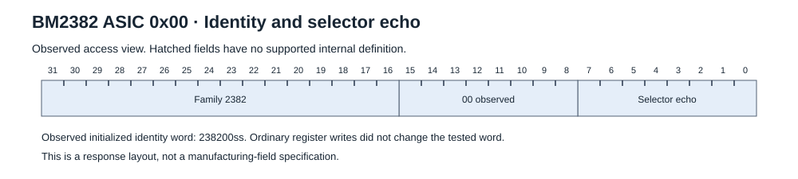

**Tested behaviour:** Upper 24 bits did not change after individual write attempts. An ordinary register write did not move selector 4a to 4b.

**Reset and restoration:** The tested identity word resisted ordinary register writes. A universal pre-initialization reset value is unknown.

**Unknown:** Manufacturing encoding and behaviour before initialization.

[Field metadata](images/register-asic-00.json) · [Observation evidence](evidence/register-observations.json)

## 0x08 Frequency recipe

**Access:** Observed read/write comparisons; use the tested selector scope.

**Stock recipe:** `d0c80211`.

**Contrast baseline:** `d0d80222`. The isolated bit trials used
`d0c60222` as their comparison word.

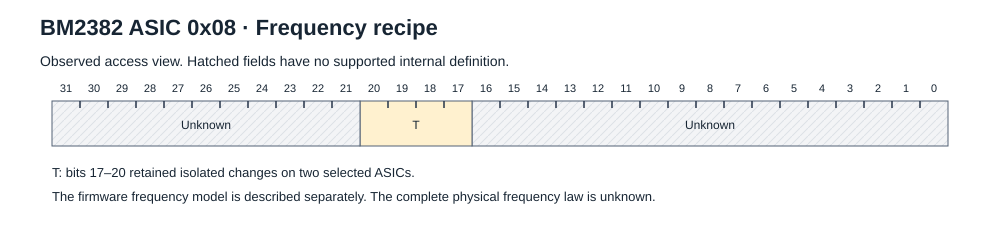

**Tested behaviour:** Bits 17–20 retained isolated changes on two selected
ASICs. Directed scope and exact restoration were tested. Each candidate was
restored before software-reset mode 1.

**Reset and restoration:** Software-reset mode 1 retained the restored word
`d0d80222`. Retention of each changed candidate through reset was not tested.
The universal board-reset value is unknown.

**Unknown:** Other bit groups, absolute clock and complete frequency law.
See the [firmware model](#firmware-frequency-model) for its separate candidate fields.

**Stock recipe example:** initializer row 200. Preserve its phase and selector scope.

```text
55aa51090008c0a202550a
```

[Field metadata](images/register-asic-08.json) · [Observation evidence](evidence/register-observations.json)

## 0x0c Independent configuration word

**Access:** Observed read/write comparisons; use the tested selector scope.

**Observed values:** `20540165`.

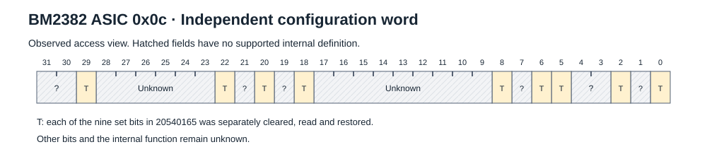

**Tested behaviour:** Each of the nine set bits could be cleared, read and
restored on two ASICs. The bit positions were 0, 2, 5, 6, 8, 18, 20, 22 and 29.
Changes to ASIC register `08` did not change this word.

**Reset and restoration:** Software-reset mode 1 retained the bit 0 clear
marker `20540164` on the selected ASIC. Reset retention of the other eight
changed words was not tested. The universal board-reset value is unknown.

**Unknown:** Zero-bit mask and clock or performance meaning.

[Field metadata](images/register-asic-0c.json) · [Observation evidence](evidence/register-observations.json)

## 0x1c Operating word

**Access:** Observed read/write comparisons; use the tested selector scope.

**Observed values:** `c0c21f10 / c0d21f10`.

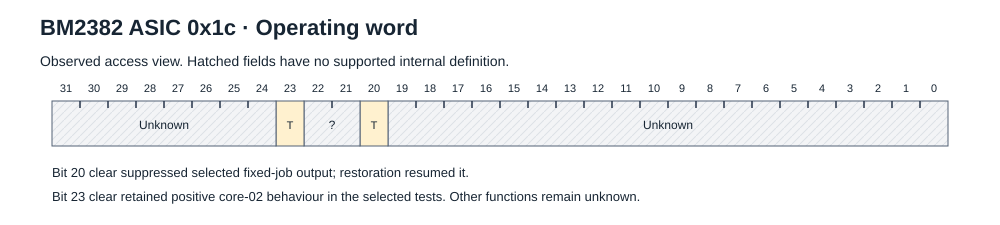

**Tested behaviour:** Clearing bit 20 suppressed the selected fixed-job output. Restoration resumed output. Clearing bit 23 retained positive core-02 behaviour in the selected tests.

**Reset and restoration:** Selected active and reset controls were tested. A complete reset-state table is unknown.

**Unknown:** Other fields and the internal cause of the output change.

**Stock recipe example:** initializer row 105. Preserve its phase and selector scope.

```text
55aa5109001cc0c21f1017
```

[Field metadata](images/register-asic-1c.json) · [Observation evidence](evidence/register-observations.json)

## 0x30 Configuration word

**Access:** Observed read/write comparisons; use the tested selector scope.

**Observed values:** `00010111 / 00012111`.

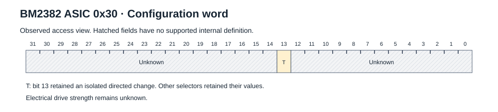

**Tested behaviour:** The directed bit 13 clear changed `00012111` to
`00010111`. Other selectors retained their values. Exact restoration was
tested on both selected ASICs.

**Reset and restoration:** Each candidate was restored before software-reset
mode 1. Mode 1 retained the restored word `00012111`. Retention of the changed
word `00010111` through this reset was not tested. Other reset states are unknown.

**Unknown:** Electrical drive strength. The firmware label does not establish this.

[Field metadata](images/register-asic-30.json) · [Observation evidence](evidence/register-observations.json)

## 0x3c Diagnostic counter

**Access:** Diagnostic read and directed zero write; read effects require the stated research policy.

**Observed values:** `variable`.

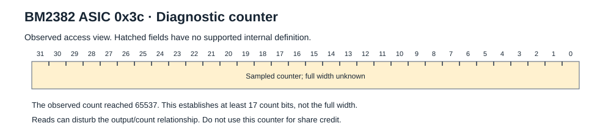

**Tested behaviour:** Directed zero cleared only the selected counter.
Observed values progressed 65535, 65536, 65537. This establishes at least
17 observed count bits. Nearby broadcast register reads can disturb the
output/count relationship. Use the bounded [diagnostic read policy](research-notes.md#counters-and-read-effects).

**Evidence limit:** The counter-boundary run failed its overall closeout and
original clock-fit gate. A separate physical wire-order synthesis proves the
counter observation. It does not change the failed run result.

**Reset and restoration:** A directed zero cleared the selected counter. The board-reset value and full counting law are unknown.

**Unknown:** Full width, counted event and lossless polling schedule.

**Stock recipe example:** initializer row 100. Preserve its phase and selector scope.

```text
55aa5109003c0000000001
```

[Field metadata](images/register-asic-3c.json) · [Observation evidence](evidence/register-observations.json)

## 0x44 Software-reset recipe

**Access:** Observed read/write comparisons; use the tested selector scope.

**Recipe writes:** `00000001` and `00000003`.

**Measured readback:** `00000003` in the stated idle, work and software-reset
sequence. A value 1 write did not make this readback equal to 1.

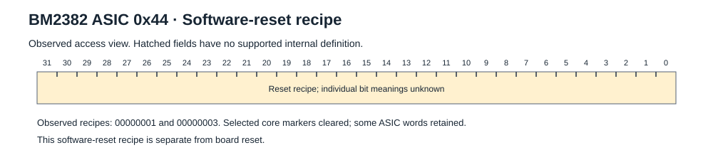

**Tested behaviour:** Tested writes changed selected positive core markers
while retaining selected ASIC words. Core `02` returned `000013` after the
tested modes 1 and 3. Core `0a` returned `000001`. Mode 1 interrupted a selected
active fixed-job output. See the [measured state sequence](#measured-state-sequence).

**Reset and restoration:** This register supplies the tested software-reset recipes. It is not the board reset signal.

**Unknown:** Independent meaning of each bit and complete state-erasure behaviour.

**Stock recipe example:** initializer row 106. Preserve its phase and selector scope.

```text
55aa410900440000000304
```

[Field metadata](images/register-asic-44.json) · [Observation evidence](evidence/register-observations.json)

## 0x50 Work-length configuration

**Access:** Observed read/write comparisons; use the tested selector scope.

**Observed values:** `0000002f`.

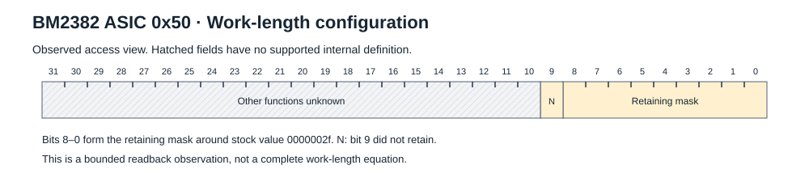

**Tested behaviour:** Single-bit tests gave a retaining mask `000001ff` around
the stock value. Bit 9 did not retain. With `50=2f`, the tested 48-byte work
image was accepted. With `50=2e`, the tested 47-byte image was rejected and
the prior job continued. Restoring `50=2f` admitted the next 48-byte image.
These images occupied 54 and 53 bytes on the wire. This is a fixed-job result
at the 300 MHz reference point. It is not a general work-length equation.

**Reset and restoration:** The stock recipe writes 0000002f. This is a startup setting, not a universal reset value.

**Unknown:** General length law and arbitrary upper-bit combinations.

**Stock recipe example:** initializer row 98. Preserve its phase and selector scope.

```text
55aa510900500000002f18
```

[Field metadata](images/register-asic-50.json) · [Observation evidence](evidence/register-observations.json)

## 0x54 Result-length configuration

**Access:** Observed read/write comparisons; use the tested selector scope.

**Observed values:** `00000007`.

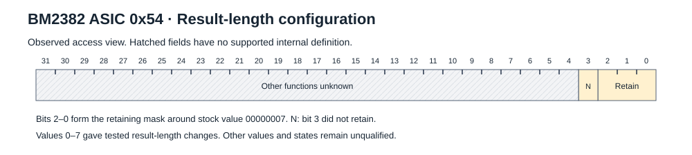

**Tested behaviour:** Values 0–7 gave the following fixed-job results at the
300 MHz reference point. The retaining mask was `00000007` around the stock
value. Bit 3 did not retain.

| Register value | Frame bytes | Observed output |
| --- | ---: | --- |
| `0` | 7 | Usually two frames per original result burst; one tested burst had three |
| `1` | 8 | Two frames per tested burst |
| `2` | 9 | One or two frames per tested burst |
| `3` | 10 | Tested shortened result |
| `4` | 11 | Tested shortened result |
| `5` | 12 | Tested shortened result |
| `6` | 13 | Tested shortened result |
| `7` | 14 | Supported full result format |

Shortened fragments are not full validated nonce submissions. Use `54=07`
for the supported driver. The measured record-splitting model reconstructs a
10-byte model record from its packed header and data. It splits that record
into pieces of n+3 bytes, where n is the register value. It suppresses pieces
with header bit 15 set and formats the remaining pieces with new CRC5 values. The model fitted
values 0 and 1 and passed frozen held-out predictions for values 2 and 4.
This describes the observed output. It does not establish FIFO anatomy or a
general rule for arbitrary jobs.

**Evidence limit:** The original combined value 2/value 4 run failed during a
later identity read. Its completed length windows have separate physical
proof. Later isolated repeats on the replacement board passed the full gates.
The earlier failure remains unresolved.

**Reset and restoration:** The stock recipe writes 00000007. This is a startup setting, not a universal reset value.

**Unknown:** General encoding outside the tested values and states.

**Stock recipe example:** initializer row 99. Preserve its phase and selector scope.

```text
55aa510900540000000709
```

[Field metadata](images/register-asic-54.json) · [Observation evidence](evidence/register-observations.json)

## 0x60 UART configuration

**Access:** Observed read/write comparisons; use the tested selector scope.

**Observed values:** `00000100 / 00001a00`.

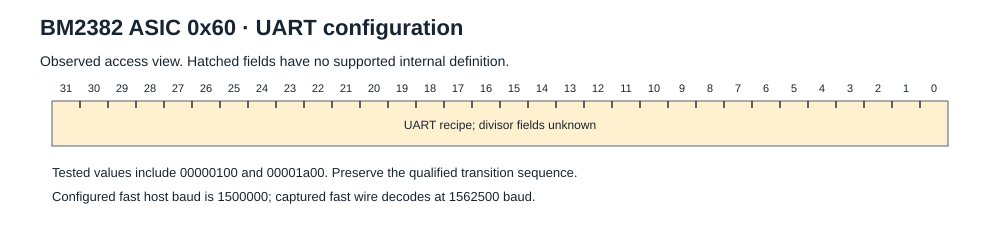

**Tested behaviour:** Physical low/fast transitions and readback were tested. Mode 1 retained 00001a00; restoration to 00000100 gave valid identity responses.

**Reset and restoration:** Software-reset mode 1 retained 00001a00 in the tested state. Restoration to 00000100 recovered valid fast responses.

**Unknown:** Clock/divisor formula and untested baud settings.
Use the [supported transition](procedures.md#change-to-the-supported-fast-uart-setting).

**Stock recipe example:** initializer row 340. Preserve its phase and selector scope.

```text
55aa510900600000010015
```

[Field metadata](images/register-asic-60.json) · [Observation evidence](evidence/register-observations.json)

## 0xc0 Temperature access setup

**Access:** Observed read/write comparisons; use the tested selector scope.

**Observed values:** `11000000 then 11020000`.

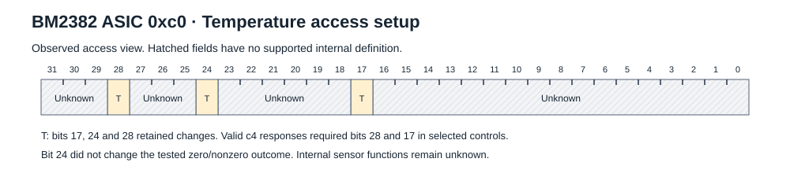

**Tested behaviour:** Bits 24, 28 and 17 retained changes. Valid c4 responses required bits 28 and 17 in the selected controls. Bit 24 did not change the zero/nonzero outcome.

**Reset and restoration:** Use the stock temperature-access recipe. A complete reset-state definition is unknown.

**Unknown:** Internal sensor conversion and other fields.
Use the [temperature procedure](procedures.md#read-temperature) for the stock recipe.

**Stock recipe example:** initializer row 292. Preserve its phase and selector scope.

```text
55aa510900c0110000001f
```

[Field metadata](images/register-asic-c0.json) · [Observation evidence](evidence/register-observations.json)

## 0xc4 Temperature result

**Access:** Temperature result read/poll; access setup uses ASIC register c0.

**Observed values:** `bit31 plus low16 ADC`.

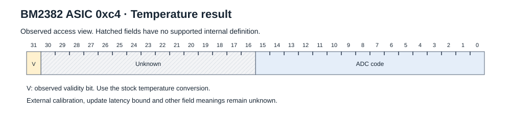

**Tested behaviour:** Directed disable returned zero for the target while another selector stayed valid. Rearming gave an initial zero response, then a fresh valid response.

**Reset and restoration:** An initial zero response occurred after rearming. Later responses were valid. A universal refresh-time bound is unknown.

**Unknown:** External calibration, update latency bound and upper-field meanings.

[Field metadata](images/register-asic-c4.json) · [Observation evidence](evidence/register-observations.json)

## 0xc8 Configuration word

**Access:** Observed read/write comparisons; use the tested selector scope.

**Observed values:** `80000064`.

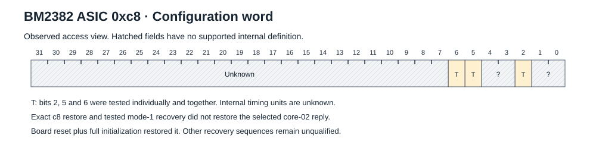

**Tested behaviour:** Clearing low set bits 2, 5 and 6 together produced
`80000000` and silenced the selected core-02 reply. Exact c8 restoration and
the tested mode 1 recovery did not restore that reply. Board reset followed
by full initialization restored it.

The individual clear and pair-clear states retained the selected core-02
reply in their tested windows. The pair-clear words `80000040`, `80000020`
and `80000004` also retained qualified fixed-job output in matched controls.

**Reset and restoration:** Board reset followed by full initialization is the
proven recovery for the tested combined change. Exact c8 restoration and the
tested mode 1 recovery were insufficient. Other recovery sequences were not
qualified.

**Unknown:** Individual timing units and internal cause of the combined change.

**Stock recipe example:** initializer row 102. Preserve its phase and selector scope.

```text
55aa510900c8800000640f
```

[Field metadata](images/register-asic-c8.json) · [Observation evidence](evidence/register-observations.json)

## 0xd0 Configuration word

**Access:** Observed read/write comparisons; use the tested selector scope.

**Observed values:** `write c0000bb8; read 80000bb8`.

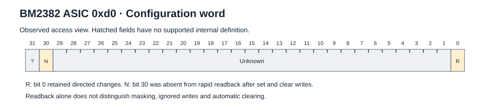

**Tested behaviour:** Bit 30 was absent from rapid readback after both set and clear writes. Bit 0 retained directed changes. Selected output continued.

**Reset and restoration:** The startup write c0000bb8 reads as 80000bb8 in the tested state. This is not a universal reset value.

**Unknown:** Masked, ignored or auto-cleared interpretation of bit 30; timing units.

**Stock recipe example:** initializer row 103. Preserve its phase and selector scope.

```text
55aa510900d0c0000bb804
```

[Field metadata](images/register-asic-d0.json) · [Observation evidence](evidence/register-observations.json)

## Reset scope

ASIC register `44` values `1` and `3` are tested software-reset recipes.
They do not substitute for board reset and cold initialization. Some ASIC
words retain their values while selected core markers change. Register `c8`
has a tested combined change for which board reset followed by full
initialization restored the selected reply. The tested rewrite and mode 1
recovery did not restore it. Do not infer a universal reset value from one observation.

## Measured state sequence

This table records one fixed-job sequence at the 300 MHz reference point on
ASIC selector `4a` of the tapped chain 2. Software-reset modes 1 and 3 were
applied after work. The operating words and selected core transitions were
also checked by a later frozen two-ASIC model. These are measured states,
not manufacturer reset defaults or a universal reset table.

`No reply` means that no typed core response arrived in the tested window.
It does not mean a numeric zero.

| Target | Initialized, no work | Work | After ASIC44=1 | After ASIC44=3 |
| --- | --- | --- | --- | --- |
| ASIC `00` | `2382004a` | `2382004a` | `2382004a` | `2382004a` |
| ASIC `08` | `d0d80222` | `d0d80222` | `d0d80222` | `d0d80222` |
| ASIC `0c` | `20540165` | `20540165` | `20540165` | `20540165` |
| ASIC `1c` | `c0c21f10` | `c0d21f10` | `c0d21f10` | `c0d21f10` |
| ASIC `30` | `00012111` | `00012111` | `00012111` | `00012111` |
| ASIC `3c` | `00000000` | `00000000` | `00000004` | `00000004` |
| ASIC `44` | `00000003` | `00000003` | `00000003` | `00000003` |
| ASIC `50` | `0000002f` | `0000002f` | `0000002f` | `0000002f` |
| ASIC `54` | `00000007` | `00000007` | `00000007` | `00000007` |
| ASIC `60` | `00000100` | `00000100` | `00000100` | `00000100` |
| ASIC `c0` | `11020000` | `11020000` | `10020000` | `10020000` |
| ASIC `c4` | `8000087d` | `8000087d` | `800008b1` | `800008b8` |
| ASIC `c8` | `80000064` | `80000064` | `80000064` | `80000064` |
| ASIC `d0` | `80000bb8` | `80000bb8` | `80000bb8` | `80000bb8` |
| Core `01` | No reply | `000000` | `000000` | `000000` |
| Core `02` | No reply | `000025` | `000013` | `000013` |
| Core `0a` | No reply | `000000` | `000001` | `000001` |
| Core `44` | No reply | `000000` | `000000` | `000000` |

The c0/c4 observations depend on the preceding sensor-request and marker
sequence. The later frozen model used restored `c0=11020000` through its
work/reset states. Do not convert these observations into one universal c0
reset rule. The diagnostic count and ADC values are time-dependent samples.

The original state-sequence gate needed an offline validator repair. The later
frozen model passed 126 matrix reads and 43 directed controls, with two recorded
read-gap deviations from the original plan. These physical findings do not
change the original failed host results.

## Frequency scope

The supported initializer ends at `08=d0c80211`. Firmware decodes this as a
625 MHz class recipe. A timing fit gives an effective 624,996,987 Hz relative
to the capture clock. This is not an absolute clock measurement.

Firmware suggests feedback and divider fields in `08`. Only the stated
isolated readback tests establish physical field behaviour. Do not transfer
BM13xx frequency equations or voltage settings to BM2382.

## Temperature access

Use this stock-derived sequence:

```text
55aa510900c0110000001f
55aa510900c0110200000a
55aa520500c417
```

The historical mining capture placed approximately 10 ms between the first
and second writes and between the second write and poll. Its cycle interval
was approximately 1 s. These are observations, not minimum silicon timings.
Require valid, complete and fresh responses. See [operation](operation.md).

## Evidence

The static [register observations](evidence/register-observations.json) retain
these scope statements. [Evidence](evidence.md) explains their provenance.
The observed counter is a diagnostic. It is not a share-credit source.

## Firmware frequency model

The recovered controller model decodes the following candidate fields from
the logical 32-bit word. Wire bytes carry this word most significant byte first.
Do not reverse the wire bytes and then interpret them as a big-endian integer.

| Field candidate | Bits | Firmware interpretation |
| --- | --- | --- |
| Range flag | 28 | Set for a model VCO above 2,400 MHz |
| Feedback | 16–23 | Multiplier |
| Post divider | 8–15 | Observed value 2 |
| Outer divider | 4–6 | Encoded value plus 1 |
| Inner divider | 0–2 | Encoded value plus 1 |

The model uses `vco_mhz = feedback * 25 / post_divider`, then
`target_mhz = vco_mhz / (outer_divider * inner_divider)`.
The constant 25 is a firmware model input. It does not establish a measured
25 MHz BM2382 reference-clock pin. The complete physical frequency law remains
unknown.

Historical mining-time bias words were:

| Word | Model target MHz | Captured writes |
| --- | ---: | ---: |
| `d0c20211` | 606.250 | 16 |
| `d0c40211` | 612.500 | 16 |
| `d0c50211` | 615.625 | 12 |
| `d0c60211` | 618.750 | 28 |
| `d0ca0211` | 631.250 | 32 |
| `d0cb0211` | 634.375 | 20 |
| `d0cc0211` | 637.500 | 12 |
| `d0ce0211` | 643.750 | 12 |

These 148 writes are historical capture observations, not qualified frequency
settings for a new driver. The selection policy and absolute clock were not
measured. Preserve the supported initializer instead.

## Additional firmware value

A separate baud helper contains `60=00000020`. It is a firmware-known value,
not the qualified fast-UART recipe. Do not replace `00000100` with it.

[BM2382 overview](README.md) · [Evidence](evidence.md) · [Unknowns](unknowns.md)
