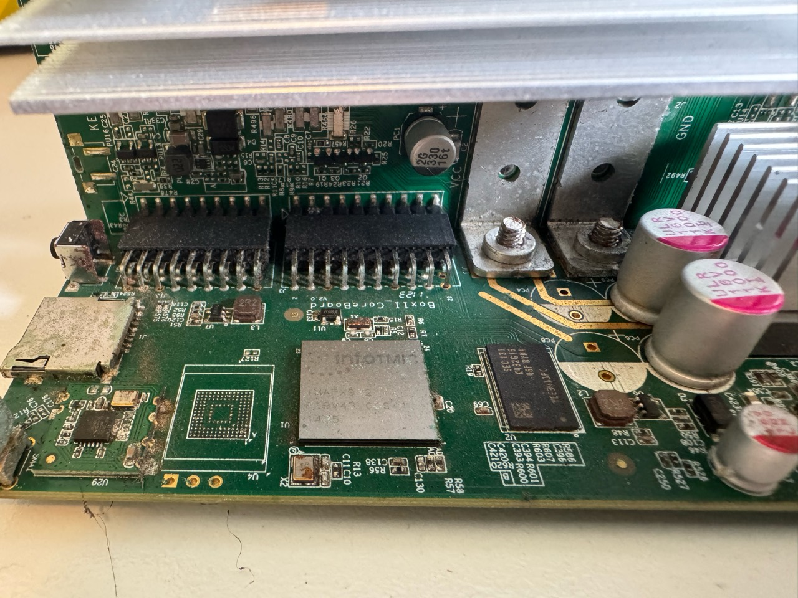
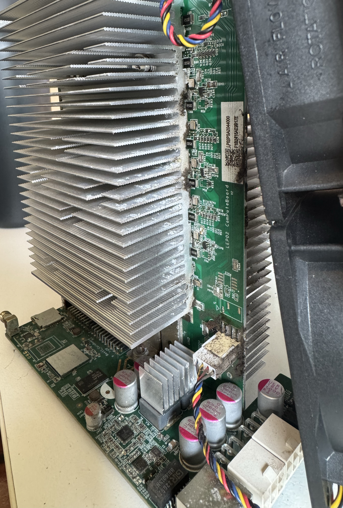
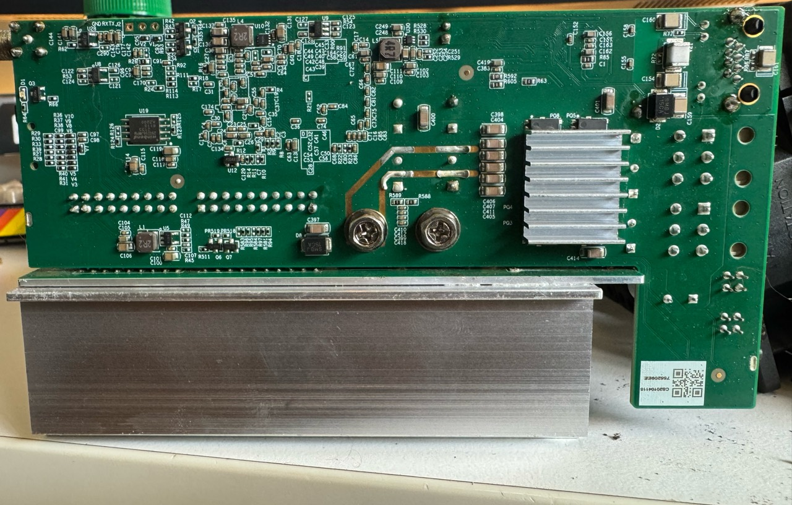
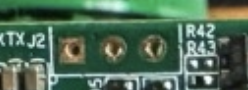
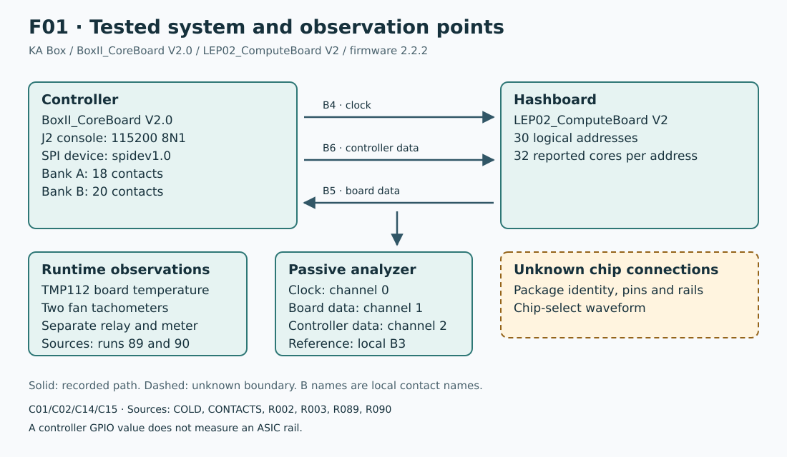
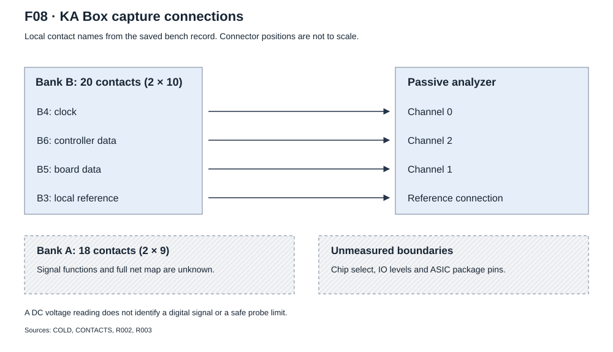
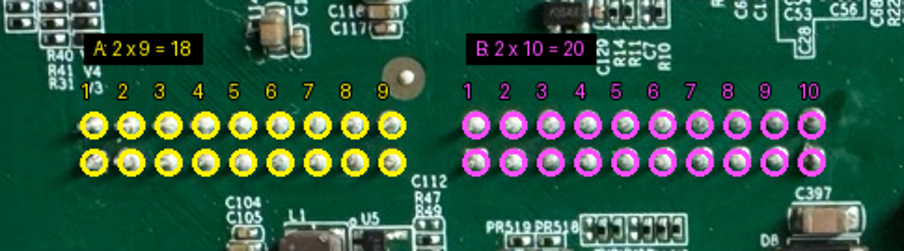

# IEN616 hardware interface

## Identity and observation points

**C01/C02.** The tested KA Box boards are `BoxII_CoreBoard V2.0` and
`LEP02_ComputeBoard V2`. The firmware identifies `IEN616`.
The photographs do not show readable ASIC package markings.
Thirty logical addresses do not show thirty physical packages.

## Board views

**Controller view.** `PHOTO-CONTROLLER` shows `BoxII_CoreBoard V2.0`, the
controller processor, two board connectors and the adjacent power links.
The large processor in this view is part of the controller. It is not the mining ASIC.

**Assembly view.** `PHOTO-ASSEMBLY` shows `LEP02_ComputeBoard V2`, its heatsinks,
the controller and the two fans. The heatsinks cover the mining ASIC packages.
This photograph does not show their number or dimensions.

**Reverse view.** `PHOTO-REVERSE` shows connector solder rows, mounting points
and the `GND RX TX J2` marking. These labels and visible traces do not give
a full continuity map.
`PHOTO-AUDIT` and `COLD` give their identities and interpretation limits.

## J2 UART console

**C19.** On the tested KA Box with firmware 2.2.2, J2 gives direct access to a
root shell without a password prompt. The console uses `ttyAMA3` at 115200 baud,
8 data bits, no parity and 1 stop bit. The recorded identity response was
`uid=0(root) gid=0(root)`.

**C20.** Positions below follow the photograph from left to right.

| Pad | Signal | Basis |
| --- | --- | --- |
| Left, square | GND | Operator identification. |
| Middle, round | TXD or RXD | Order unconfirmed. |
| Right, round | TXD or RXD | Order unconfirmed. |

The [console and pad records](evidence/j2-console.json) give the saved response
and operator report.

## Controller and board connections

F01 shows the recorded connection boundaries. Solid lines show the recorded
paths. A dashed box marks the unknown package connections. Sources:
`COLD`, `CONTACTS`, `R002`, `R003`, `R089` and `R090` in the
[catalog](evidence/source-catalog.json).

| Interface | Observation | Limit |
| --- | --- | --- |
| Controller console | J2, 115200 baud, 8 data bits, no parity, 1 stop bit | This is a controller UART. It is not an ASIC command UART. |
| Controller device | `/dev/spidev1.0` | Configuration and selected stock path. |
| Capture clock | Local contact B4, analyzer channel 0 | Captured digital signal. |
| Controller data | Local contact B6, analyzer channel 2 | Controller-to-board bytes. |
| Board data | Local contact B5, analyzer channel 1 | Board-to-controller bytes. |
| Capture reference | Local contact B3 | This connection does not show each ground domain. |
| Additional tap | Local contact B8 | Function is unknown. |
| Chip select | Not captured | Decoder gaps do not show chip-select boundaries. |

F08 follows the local contact names in `COLD`, `CONTACTS`, `R002` and `R003`.
It shows the tested analyzer connection. It does not assign manufacturer pin
numbers or identify an ASIC package pin.

The firmware sets SPI mode 1 with 8 bits per word. Captured timing and valid
packets strongly indicate mode 1 with the most significant bit first.
The stock path requests 500 kHz, then 1 MHz during initialization.
Digital decoding does not measure acceptable voltage, overshoot or signal margin.

## Connector observations

**C01.** The contact-count audit found 18 contacts in bank A and 20 in bank B.
Their layouts are 2 × 9 and 2 × 10. The earlier report of 18 contacts in both
banks is incorrect for bank B.

Bank A is on the pushbutton side. Bank B is on the power-link side.
Names such as B4 are local observation names, not manufacturer pin numbers.
The second rows and B10 lack a full measurement record.

The photograph is the unchanged `CONTACT-PHOTO` asset. `CONTACT-RECEIPT`
identifies the source photograph and annotation coordinates. Its numbers
identify columns for this view. They do not show manufacturer pin numbers.

| Contacts | Operator record | Evidence limit |
| --- | --- | --- |
| A1/A2/A4/A5/A6 | Grouped range, 3.13-3.33 V DC | No separate value for each contact. |
| A7/A8 | 0.0 V DC | Does not show ground or absence of switching. |
| A3/A9/B3/B9 | Cold reading `01.2`, equal to the probe-tip baseline | The source does not show calibrated resistance or common net identity. |
| B1/B2 | 11.82 V DC | Supply candidates only. |
| B4/B5/B6/B8 | 0.03/0.00/0.85/1.64 V DC | A DC reading can average signal activity. |
| B7 | 5.05 V DC | Supply candidate only. |

The timing of the run-02 voltage observations is ambiguous. B1, B2 and B7
were more than that survey's 5 V stop limit. The readings stay historical evidence.
They are not acceptable probe limits or instructions for another survey.

## Power, cooling and sensors

**C14/C15/C18.** The independent runtime used direct TMP112 board readings,
two tachometers and a separate relay watchdog. The run-89 fan test showed a
physical response of the two fans to levels 100, 80 and 100.
The [stock integration page](stock-integration.md#two-fan-control) gives the cooling observations.
The [operation page](operation.md) gives the stop conditions.

GPIO 66 and 67 are the configured enable and reset outputs. Their readbacks
show controller output state. LOW does not show rail discharge.
Configured supply GPIOs 14, 45 and 50 lack a measured rail map.

Whole-miner OFF / 0 W / 0 A is the recorded last meter state.
It does not show zero voltage at each internal node.
Chip junction temperature, sensor calibration, mounting pressure, package
dimensions and electrical ratings stay [unknown](unknowns.md).

## Chip interface and new-board requirements

The [protocol](protocol.md) defines the recorded SPI messages.
The [register page](registers.md) defines the five selected selectors and their limits.
The stock code reports 32 cores at each of 30 logical addresses.
Run 75 returned every core coordinate from 0 through 31.
Neither observation gives a physical package count or physical lane map. Sources: C13, `CORE-CENSUS` and `R075`.

Package dimensions, pin numbers, pin functions, rail voltages, clock input and absolute electrical ratings are unknown.
No isolated-chip test, minimum population test or independent new-board test is recorded.
The stock board supplies these functions, but its internal design is not shown.
[Unknowns](unknowns.md) records the measurements needed for a new board.
