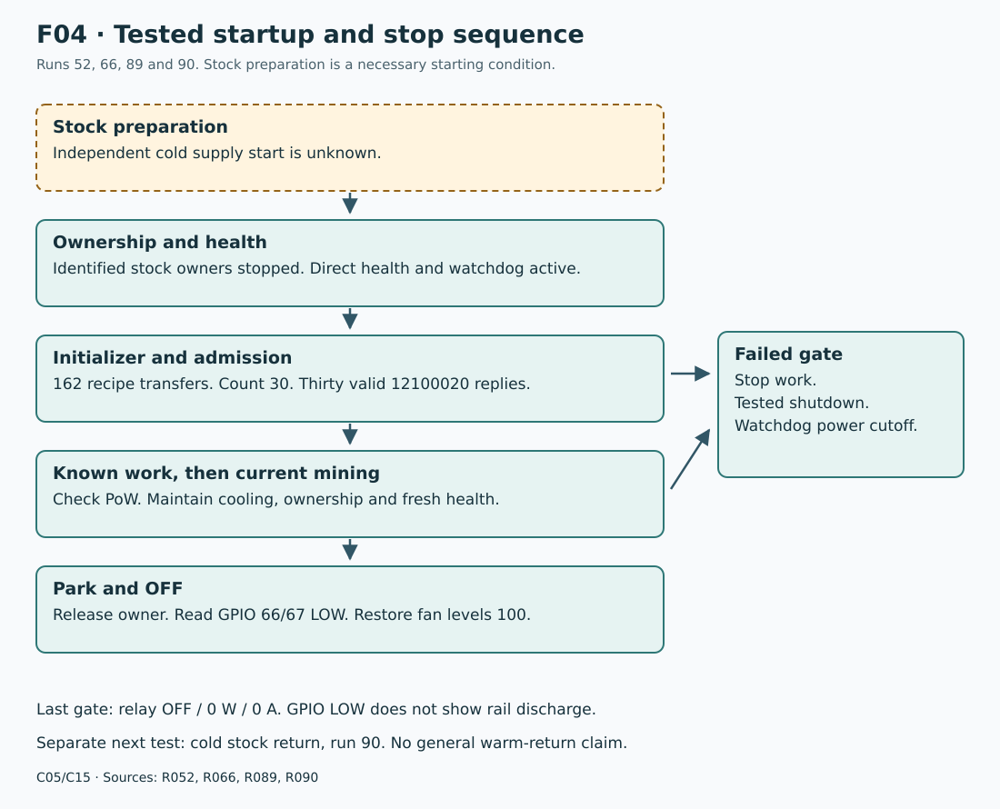
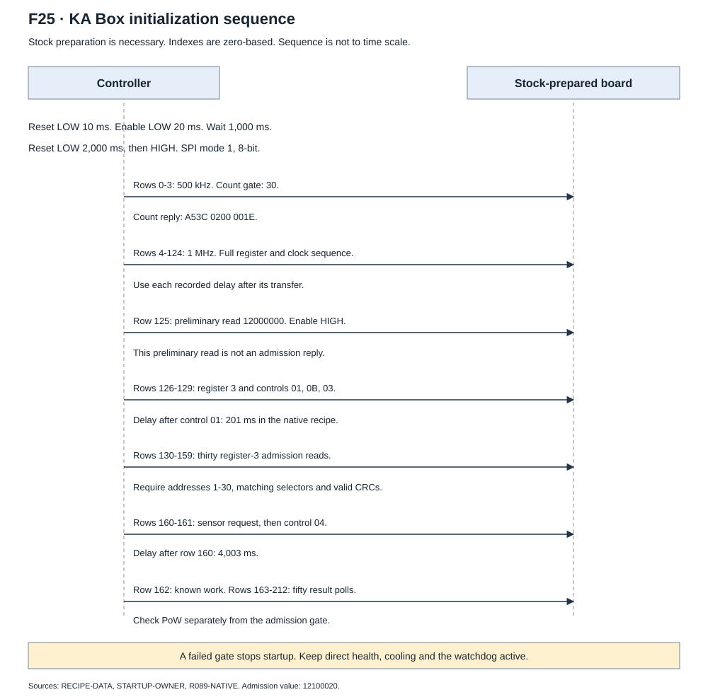

# IEN616 initialization

## Tested starting state

**C05.** The independent initializer operates after stock board preparation.
It does not replace the unknown cold supply sequence. The recorded
[162-transfer capture](evidence/initialization-capture.json) and
[run-89 native transfers](evidence/run89-initialization.json) give unchanged TX/RX bytes.

The native record contains 213 transfers: 162 recipe transfers, one known-work
transfer and 50 polls. Each row has its speed, length and bytes.
The recorded stock capture also supplies observation times.

F04 uses `R052`, `R066`, `R089` and `R090`. Its dashed starting box marks the
stock dependency. It is a record of the tested sequence, not a new powered plan.

## Tested sequence and gates

| Stage | Recorded action | Necessary response or failure path |
| --- | --- | --- |
| Stock preparation | Stock software prepares the board and starts stock mining. | Independent supply preparation stays unknown. |
| Ownership | Stop the identified stock device and management owners. Start the selected cooling owner. | Run 89 stops `kaspaminer`, `minerd`, `xminerd` and `fanctrl`. |
| Direct health | Read board temperature and the two tachometers. Start the separate watchdog. | Stop if specified health data or ownership is invalid. |
| Reset and enable | Apply the tested reset/enable schedule. | Controller readback is necessary. It does not measure rails. |
| Count | Set 500 kHz and send the recorded count request. | Make sure that the count is 30. |
| Recipe | Send the full recorded register/control sequence and speed changes. | Keep order, waits, lengths, CRC and zero padding. |
| Admission | Read register 3 at addresses 1-30. | Make sure that all thirty replies have correct CRCs and the value `0x12100020`. |
| Known work | Send the fixed work and poll for results. | Check recorded-input PoW separately from any pool decision. |
| Independent runtime | Start current work and the selected cooling policy. | Keep ownership, health and watchdog checks active. |
| Stop | Release the independent owner and read enable/reset LOW. | Close volatile access. Check relay OFF / 0 W / 0 A. |

The [operation page](operation.md) gives the runtime gates.
[KA Box stock integration](stock-integration.md) gives the controller and cooling conditions.
The [procedure page](procedures.md) gives the supported tasks and saved-evidence checks.

## Ordered native recipe

The [162-row TSV](evidence/initialization.tsv) gives the actual native recipe.
Each row has a zero-based index, SPI speed, transfer length, delay and TX prefix.
Fill the remaining transfer bytes with zero. The delay applies **after** that
transfer. Each reconstructed TX buffer equals the corresponding run-89 buffer.

| Index | Action | Gate or timing |
| --- | --- | --- |
| Before 0 | Check mode 1, 8-bit words and initial host speed 1 MHz. Select 500 kHz. | Check the host settings. Stock preparation and exclusive ownership are necessary. |
| Before 0 | Reset LOW for 10 ms. Enable LOW for 20 ms. Wait 1,000 ms. Reset LOW for 2,000 ms, then HIGH. | Check each controller output. Keep direct health checks active. |
| 0 | Count request | Make sure that the count at the tested receive position is 30. |
| 1-3 | Register-5 read/write and register-6 read | Use 500 kHz. Select 1 MHz after row 3. |
| 4-124 | Register-6 setup and full register-0 sequence | Keep every word, read and delay. Last target word in the sequence is `46270060`. |
| 125 | Preliminary address-1 register-3 read | Recorded reply is `12000000`. Set enable HIGH after this transfer. |
| 126 | Write register 3 | Recorded value `12100000`. |
| 127-129 | Controls 01, 0B and 03 | Delay 201 ms after row 127. |
| 130-159 | Read register 3 at addresses 1-30 | Examine all thirty replies for value `12100020`, matching addresses and selectors, and correct CRCs. |
| 160 | Chip sensor request `0C00` | Delay 4,003 ms after this transfer. |
| 161 | Work control `0400 00E5` | Keep its 608-byte transfer and 1 ms delay. |
| 162 | Known-work packet | This additional transfer starts the local PoW gate. |
| 163-212 | Fifty result polls | Each poll is followed by a 20 ms delay. |

The native owner checks health during long waits in intervals of at most
500 ms. The recorded delays are controller recipe values, not minimum ASIC timings.
The initial GPIO schedule does not replace stock supply preparation.

Sources: `RECIPE-DATA`, `STARTUP-OWNER` and `R089-NATIVE`.
The capture timestamps and the rounded native waits are separate records.
Do not derive a new wait from only the last register value.

## Source sequence

`F03-COLD-INITIALIZATION-AUDIT` records the selected stock path:

1. Reset is LOW for 10 ms. Enable is LOW for 20 ms.
2. A 1 second wait follows controller setup. Reset then stays LOW for 2 seconds before HIGH.
3. The stock path requests 500 kHz, enumerates positions and sets register 5.
4. It requests 1 MHz, sets register 6 and applies the selected clock sequence.
5. Enable goes HIGH for 20 ms. The stock code requests fan values 55 and 40.
6. Register-3 reads and sensor collection follow adaptive setup and a 1 second wait.

These fan values are source observations. They are not the independent cooling
policy. The source also contains a 0-4 second wait.
The purpose of the last 4.003 second idle in the captured recipe is unknown.

## Stronger admission in the independent driver

The stock initializer can exhaust five attempts and still return success.
Its fallback stores 666 for a failed core-count read or zero for a successful
read. It does not show successful initialization.

The independent driver instead checks the specified count, each admission reply,
valid direct health, checked speed readback and release of its device descriptor.
A missing reply is a failed gate. It is not a zero register value.

In the included zero-based transfer arrays, admission reads occupy rows 130-159.
The earlier register-3 read at row 125 returns `12000000` at address 1.
That preliminary read is not an admission result.

## Reset and recovery evidence

Run 52 recorded three full initializers and 27 independently checked known-work
results. Each initializer returned the same nine valid identities.
These historical-work results are not new accepted shares.

Run 66 tested a narrower recovery. Reset LOW for 2 seconds removed all 150
accepted reads across five selectors and thirty positions.
Recipe transfers 127-129, `0100`, `0B00`, `0300`, restored zero accepted replies.
The full initializer then restored all 150 reads and the expected register words.

Reset-only register values stay unknown. Full initialization includes register
writes, so its later values are not evidence of power-on defaults.
Separate cold stock return is proven in run 90. General warm stock return is not.
