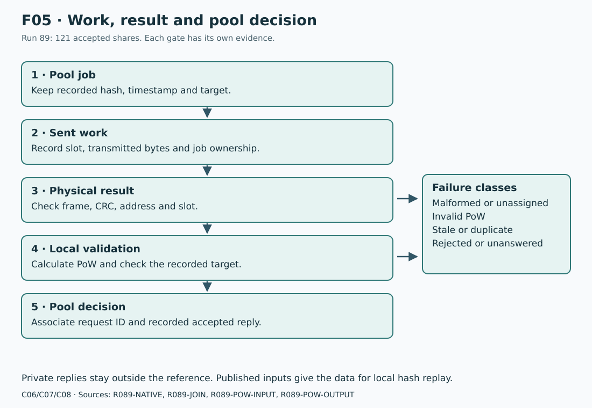

# IEN616 mining

## Job, work and result association

**C06-C08.** The host keeps the recorded job, timestamp, target and wire slot.
The work packet carries the hash, timestamp, nonce bounds and filter word.
The result carries a slot, logical address, nonce and core coordinate.
It does not carry the full recorded job or pool target.



F05 uses `R089-NATIVE`, `R089-JOIN`, `R089-POW-INPUT` and `R089-POW-OUTPUT`.
Each decision is separate. A CRC-valid result can fail PoW. A valid PoW can
miss the pool target. A submitted result can lack an accepted reply.

| Stage | Necessary association or check | Failure class |
| --- | --- | --- |
| Job admission | Recorded hash, timestamp and target belong to the current pool job. | Invalid job input |
| Work assignment | Record the slot and unchanged transmitted work. Slots cycle from 1 through 15. | Missing or replaced assignment |
| Result decode | Check header, length, CRC, slot, address and tested trailing byte. | Malformed or unsupported result |
| Work association | Select the preceding work assigned to that slot. Check its current ownership. | Unassigned or stale result |
| Local PoW | Calculate the digest from the recorded hash, timestamp and returned nonce. | Invalid result |
| Target decision | Compare that digest with the job's recorded target. | Valid result below the specified work level |
| Submission | Keep the job identity, nonce and request ID. | Duplicate or stale submission |
| External reply | Associate the pool reply with that request. | Rejected, unanswered or accepted share |

The source constructor replaces occupied slots and sends control `0400 00E5`
before work. Run 65 tested selected pending-result replacement states.
Unknown late results across arbitrary slot reuse stay a separate limit.

## Hash and filter interpretation

**C07.** Canonical input consists of a 32-byte pre-PoW hash, timestamp and nonce.
The wire reverses the full hash byte sequence. The canonical hash calculation
uses the recorded bytes. The last digest is a little-endian 256-bit value.

The selected firmware hash audit compared 45 completed cases with an independent
Rust implementation. All last digests matched. Fifteen cases used synthetic
nonzero seeds and boundary values. This was offline software execution.
The [software page](software.md) records the all-zero-seed exception.

For the tested valid candidates, the most significant 64 digest bits meet the
filter word. For example, `0x0000000007FFFFFF` selects the recorded 37-bit filter.
Filter 32 in the later records means word `0x00000000FFFFFFFF`.
Invalid ASIC outputs can have valid CRCs and fail this comparison.
The host must calculate PoW for each candidate.

The wire filter is not the pool target. The pool target can change independently.
The replay inputs must keep the target that applied to the recorded job.

## Host PoW byte order

The wire representation and the hash input use different byte orders:

| Input | Wire representation | Canonical hash input |
| --- | --- | --- |
| Pre-PoW hash | All 32 bytes reversed | Original canonical bytes |
| Timestamp | Unsigned 64-bit big-endian | The same integer, little-endian |
| Result nonce | Unsigned 64-bit big-endian | The same integer, little-endian |

The first hash input has 80 bytes:

```text
PRE_POW_HASH[32] | TIMESTAMP_LE[8] | ZERO[32] | NONCE_LE[8]
```

Use Kaspa `kHeavyHash`. The two cSHAKE256 domains are `ProofOfWorkHash` and
`HeavyHash`. The matrix is generated from the pre-PoW hash and can be kept
for candidate checks for that job. Do not substitute SHA-256.
The last 32-byte digest is a little-endian integer.
Sources: `POW-SOURCE`, `POW-STAGES-SOURCE` and the matched firmware hash audit.

## Pool target

The tested adapter uses this difficulty-one target, shown big-endian:

```text
00000000ffff0000000000000000000000000000000000000000000000000000
```

For a positive integer difficulty `d`, it calculates
`floor(difficulty_one_target / d)`. A candidate passes when
`digest_integer <= target_integer`. Equality is accepted.
This is the recorded adapter rule. Other pool formats need their own target check.
Sources: `POOL-TARGET-SOURCE` and `POW-HELPER-SOURCE`.

## Accepted-share evidence

**C08, proven for the recorded run.** All four stock control processes were
stopped in run 89. The independent miner used automatic cooling and current pool work.

| Run-89 observation | Recorded value |
| --- | ---: |
| Native mining interval | 120.013 seconds |
| Jobs sent | 297 |
| Result polls | 3,774 |
| Candidates received | 742 |
| Candidates that passed the filter | 740 |
| Candidates that passed the recorded target | 128 |
| Stale results | 7 |
| Shares submitted | 121 |
| Shares accepted by the pool | 121 |
| Duplicate results | 0 |
| Invalid or retired results | 2 |
| Native TX/RX transfers matched to passive SPI | 4,581 |

The pool-side completion record spans 120.059 seconds. This is a different
observation interval from the native mining interval.
The [control extract](evidence/run89-control.json) keeps the two values.

The [physical association report](evidence/run89-physical-join.json) gives each
accepted nonce, slot, sequence, request ID, transfer indexes and digest.
It also identifies the private recorded replies by hash.
The [share-packet extract](evidence/run89-share-packets.json) supplies the
121 associated work/result pairs with their captured bytes.
The published [inputs](evidence/run89-pow-input.tsv) and
[outputs](evidence/run89-pow-output.tsv) supply the data for independent hash replay.
They do not give the private pool transcript.

### One recorded example

| Field | Recorded value |
| --- | --- |
| Request ID | `3` |
| Sequence / slot | `189` / `13` |
| Nonce | `6ccc0e00720aeb25` |
| Pool difficulty | `1024` |
| Physical work / result transfer | `971` / `975` |
| Last digest, little-endian | `b2461acc5e8f357ee690040b037380031f1400227f9bd09182233b0000000000` |
| Recorded target check | `true` |

The canonical pre-PoW hash for this example is:

```text
ae9581e8b8090d9d0dfb3b7ee54499cf73444df610dbb91187988cb3bcaa323f
```

The timestamp is `1791367276411` milliseconds. Difficulty `1024` gives
this big-endian target:

```text
00000000003fffc0000000000000000000000000000000000000000000000000
```

Captured work packet, without transfer padding:

```text
a53cd7003f32aabcb38c988711b9db10f64d4473cf9944e57e3bfb0d9d0d09b8e88195ae000001a115cf677b6ccc0000000000000000000007ffffff6cccffffffffffff950f
```

Captured result packet:

```text
a53cd80f6ccc0e00720aeb25120030a5
```

The result decodes to slot 13, address 15, core coordinate 18 and trailing byte 0.
Both packet CRCs pass. The host reproduces the recorded digest and target result.
The external acceptance also depends on the recorded pool reply for request 3.

Line 1 of each TSV belongs to this example. The input has four decimal u64
pre-PoW words, a decimal timestamp and a hexadecimal nonce.
The output has a row number, two intermediate digests and the last digest.
The four input words use little-endian order within the canonical hash.

## Earlier operating evidence

| Run | Result | Scope difference |
| --- | --- | --- |
| 46 | 184 accepted shares, then 15 from a fresh owner | 616.402 and 121.017 seconds. Stock fan control stayed active. |
| 81 | 37 accepted shares | All four stock controllers stopped. Fixed full-speed cooling. |
| 83 | 137 accepted shares | Variable two-fan response tested separately in the same run. |
| 85 | 69 accepted shares | Automatic cooling occurred, but its tachometer baseline gate failed. |
| 89 | 121 accepted shares | Automatic cooling passed the revised physical gates. |

These are separate test runs. They do not form one continuous endurance test.
Run 02 had a digest that met the recorded pool difficulty, with a consistent
stock log. Its direct nonce-to-pool-reply association was only strongly indicated.

## Full fixed-work population

**C12.** Run 75 recovered all 475 predicted valid identities in ten segments.
All 300 source/segment observations matched their expected valid sets.
Four invalid candidates stayed separate. No valid identity was missing,
extra or duplicated across segments.

Each segment has a maximum of four expected valid results per source.
This leaves one recorded entry for the recorded invalid-result class.
The [prediction data](evidence/segment-vectors.json) and
[physical comparison](evidence/segmented-results.json) keep full sets.
The [research page](research-notes.md) explains why an unsegmented job lost results.
