# IEN616 protocol

## Transport and frame boundaries

**C02-C04.** A packet starts with bytes `A5 3C`. The next two bytes form a
big-endian command word. A full SPI transfer also contains response space
and zero padding. Packet length and transfer length are different quantities.

The source table has 15 request forms. The
[command extract](evidence/command-templates.json) keeps their response alternatives.
The [packet examples](evidence/packet-examples.json) keep unchanged captured bytes.
`F01-TRANSPORT-CLOSURE-AUDIT` and `F02-COMMAND-REGISTER-AUDIT` identify the
matched software and its offline checks.

| Command bits | Meaning in tested work/result packets |
| --- | --- |
| 15-12 | Work slot, 1-15. Zero is not a work slot. |
| 11-8 | Opcode. Work uses 7. A result uses 8. |
| 7-0 | Logical address. Zero selects the tested broadcast form. |

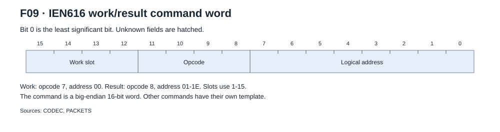

F09 shows the command split for work and results. Read the two command bytes
as one big-endian integer. For example, `D80F` means slot 13, result opcode 8
and logical address 15. Sources: `CODEC` and `PACKETS`.

Other commands use the same word as specified in the table below.
`XX` stays an opaque byte in the control templates.

| Request word | Payload bytes | CRC on request | Selected function and limit |
| --- | ---: | --- | --- |
| `0800` / `08NN` | 2 | No | Result poll. The tested stock scan uses address zero. |
| `0200` | 2 | No | Logical count. The recorded reply gives 30. |
| `01XX`, `03XX`, `0BXX` | 0 | No | Startup controls. Their full internal effects are unknown. |
| `0400` / `04NN` | 2 | No | Control 04. The tested work sequence uses `0400 00E5`. |
| `Y700` / `Y7NN` | 64 | Yes | Work. Broadcast is physically tested. Other forms stay source evidence. |
| `0900` / `09NN` | 6 | Yes | Register write. Selector is 2 bytes, then a 4-byte value. |
| `0ANN` | 2 | No | Register read. Reply `1ANN` has selector, value and CRC. |
| `0C00`, `1C00` | 10 | No | Selected chip-temperature requests. The response data has 30 bytes. |

`NN` is the logical address. `Y` is the work slot nibble.
The sensor consumer copies five 16-bit words from each accepted sensor reply.
Unused sensor bytes have no assigned meaning. These replies are not result counters.

## Logical count

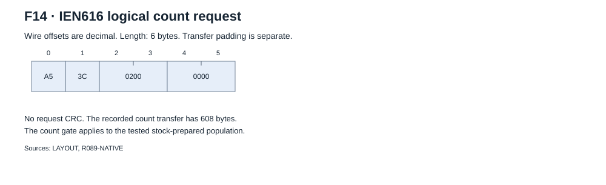

The recorded request is `A53C 0200 0000`. It has no CRC.
Run-89 transfer 0 clocks 608 bytes and returns this count message:

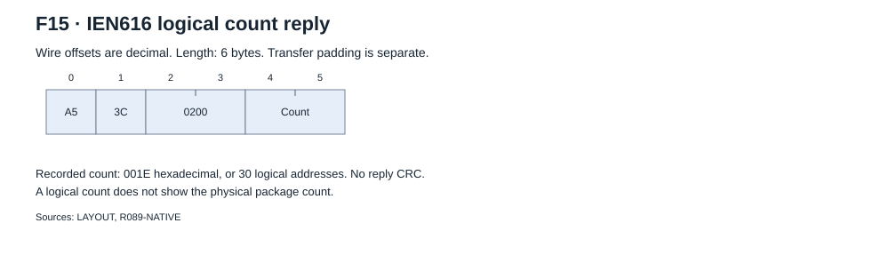

```text
A53C 0200 001E
```

`001E` is 30 in decimal. The native count gate checks this response at receive
offset 180 in its tested startup phase. It does not enumerate physical packages.

## Register write and read

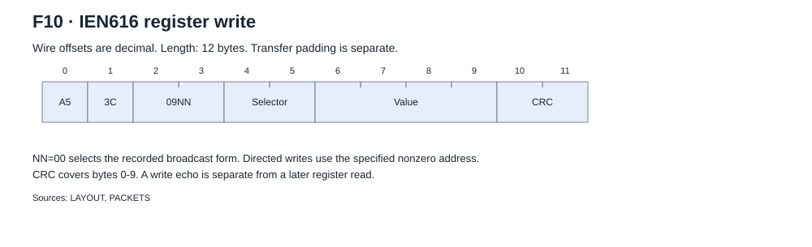

```text
A53C 09NN SELECTOR_BE[2] VALUE_BE[4] CRC_BE[2]
```

A broadcast write uses address `00`. Directed writes use the specified logical
address. The source table has separate reply forms for these requests.
A returned write echo does not replace a later register read.

Run-89 transfer 2 writes zero to register 5:

```text
A53C0900000500000000B31A
```

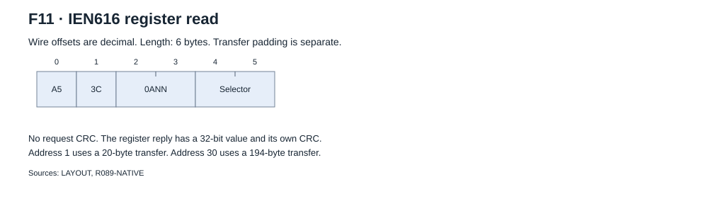

```text
A53C 0ANN SELECTOR_BE[2]
```

There is no request CRC. The [reply](figures/register-packet.svg) contains the
address, selector, 32-bit value and CRC. Run-89 transfer 1 reads register 5
at address 1:

```text
Request: A53C0A010005
Reply:   A53C1A0100050000000136DA
```

This early read returns 1. The later write sends zero. These are different
observations. The [register reference](registers.md) gives the measured states,
selected bit effects and reset limits.

## Startup controls

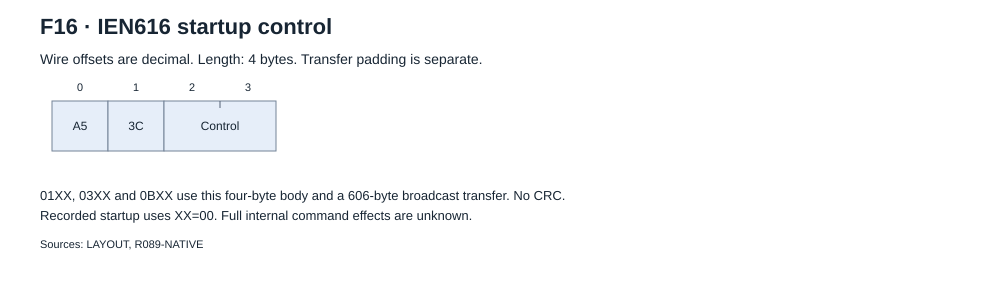

The recorded sequence sends `A53C0100`, `A53C0B00` and `A53C0300` in that order.
Each body has four bytes, no CRC and a matching four-byte echo.
Each tested broadcast transfer clocks 606 bytes.

The native recipe waits 201 ms after control 01. Use the full
[ordered recipe](initialization.md#ordered-native-recipe).
These three commands alone did not restore addressed replies after reset in run 66.
Their full internal effects are unknown.

## Work control

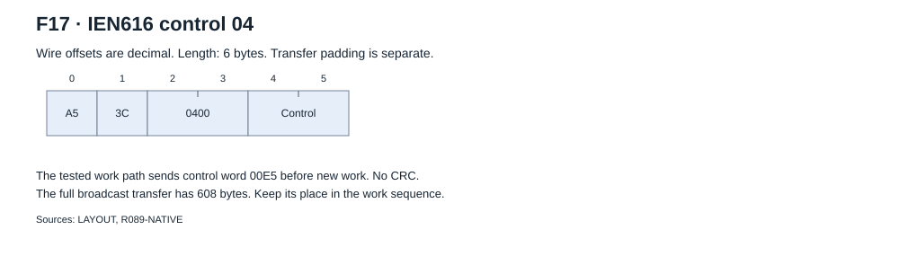

The tested work path sends `A53C040000E5` before new work.
The packet has no CRC. The full broadcast transfer has 608 bytes.
The recorded echo repeats the six-byte message.
Selected old-result replacement tests are in [research findings](research-notes.md).

## Result poll and empty reply

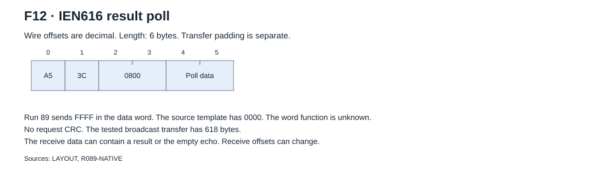

The run-89 native request is `A53C0800FFFF` in a 618-byte transfer.
The source template contains `0000` in the data word. The word's internal
function is unknown. Keep the tested request for its specified path.

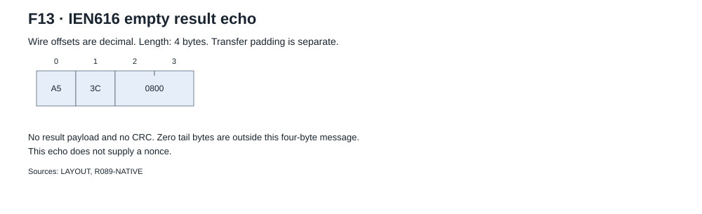

The recorded empty echo is `A53C0800`. It has no nonce or CRC.
Its zero tail belongs to the transfer. A nonempty reply must pass the
[result checks](#result-packet). Receive offsets can change.

## Chip sensor messages

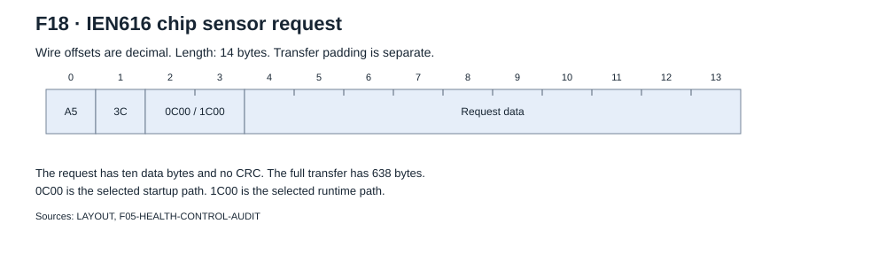

`0C00` is the selected startup request. `1C00` is the selected runtime request.
Both have ten data bytes, no request CRC and a 638-byte transfer.
The run-89 startup request is:

```text
A53C0C0000000000FFFFFFFFFFFF
```

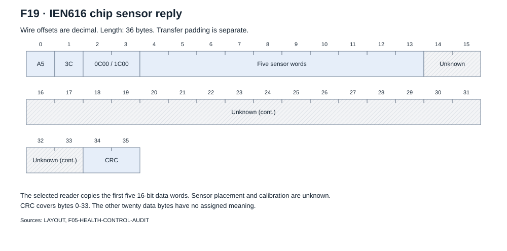

The reply has thirty data bytes and a CRC over bytes 0-33.
The selected source reader copies the first five 16-bit words.
It ignores the other twenty data bytes. Their meaning is unknown.
The [software page](software.md#sensor-and-thermal-software) gives the conversion
and its limits. These messages do not supply a calibrated junction temperature
or an ASIC result counter.

The [command examples](evidence/command-examples.json) contain ten captured
exchanges with their transfer indexes and receive offsets. Their source is
`R089-NATIVE`. `LAYOUT`, `CODEC` and `F05-HEALTH-CONTROL-AUDIT` explain the
construction and selected source use. Full TX/RX bytes stay in the
[native extract](evidence/run89-initialization.json).

## Transfer sizes

The matched builder selects the longer transmit or receive form, including its
tail. It then adds the chain delay. The recorded 30-position broadcast delay
is 600 bytes. A directed transfer adds six bytes per logical address.

| Transfer | Full bytes |
| --- | ---: |
| Broadcast result poll | 618 |
| Broadcast work | 672 |
| Broadcast register write | 614 |
| Address-1 register write or read | 20 |
| Address-30 register write or read | 194 |
| Logical count or broadcast control 04 | 608 |
| Broadcast control 01, 03 or 0B | 606 |
| Sensor request 0C or 1C | 638 |

These values apply to the tested population. They do not qualify another chain
length. A decoder gap is an analysis boundary. Some recorded transfers cross
more than one decoder burst.

The source SPI callback creates one transaction descriptor. Its examined
500 kHz fixture uses a 3 microsecond delay, 8-bit words and `cs_change=0`.
The physical chip-select waveform is unknown.

## CRC

**C03, proven for the captured CRC families.** The CRC register starts at zero.
The reflected polynomial is `0x8408`. For each adjacent wire-byte pair,
the calculation consumes the second byte before the first byte.
The calculation covers the header, command and payload. It does not include the CRC
and transfer padding. There is no last XOR. The two CRC bytes are big-endian.

| Captured packet | Covered bytes | CRC bytes |
| --- | --- | --- |
| Register reply | `A53C1A01000500000001` | `36DA` |
| Register write | `A53C0900000500000000` | `B31A` |
| Result | `A53C281D69B81C00DAAEBE681400` | `E6A7` |

Run 02 supplied 2,292 accepted CRC packets across the selected families.
That count belongs to run 02. Later captures contain CRC failures that stay
in the evidence record.

## Work packet

**C06.** Offsets below start at the first `A5` byte. The packet is 70 bytes.
It occurs inside the 672-byte broadcast transfer.

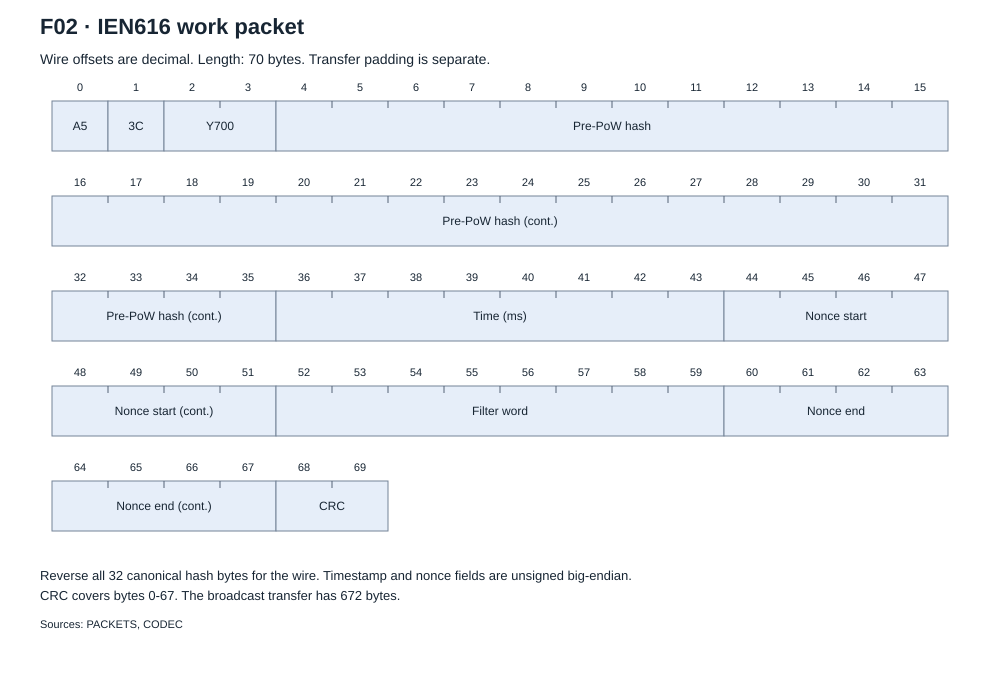

| Wire offset | Width | Field | Order and unit |
| --- | ---: | --- | --- |
| 0 | 2 | Header | `A5 3C` |
| 2 | 2 | Command | Big-endian `Y700` |
| 4 | 32 | Pre-PoW hash | Reverse the full 32-byte canonical hash for the wire. |
| 36 | 8 | Timestamp | Big-endian, milliseconds |
| 44 | 8 | Nonce start | Big-endian unsigned integer |
| 52 | 8 | Filter word | Big-endian unsigned integer |
| 60 | 8 | Nonce end | Big-endian unsigned integer |
| 68 | 2 | CRC | Coverage: bytes 0-67 |

F02 and its [metadata](figures/work-packet.json) use `PACKETS` and `CODEC`.
Range interpretation belongs to
[the tested allocation model](research-notes.md).

## Result packet

**C06.** A result packet is 16 bytes. The command is `Y8NN`.

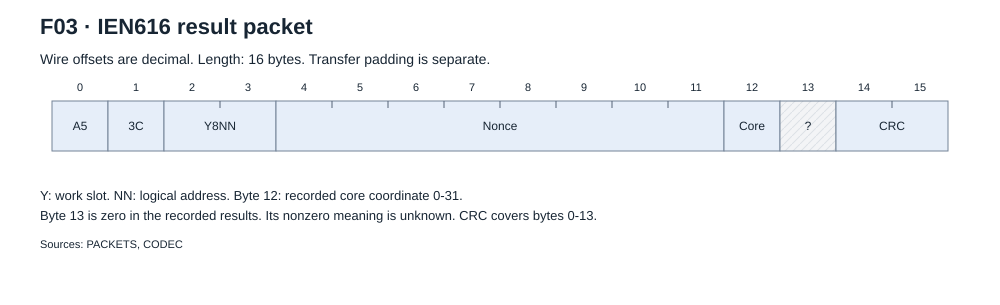

| Wire offset | Width | Field | Recorded meaning |
| --- | ---: | --- | --- |
| 0 | 2 | Header | `A5 3C` |
| 2 | 2 | Command | Work slot and logical address |
| 4 | 8 | Nonce | Big-endian unsigned integer |
| 12 | 1 | Core coordinate | Values 0-31 in the recorded corpus |
| 13 | 1 | Trailing byte | All recorded values are zero. The codec names it `ntime_index`. |
| 14 | 2 | CRC | Coverage: bytes 0-13 |

The interpretation of a nonzero trailing byte is unproved. The independent
replay path rejects it. Early notes treated the last two payload bytes as one
little-endian core word. All-zero high bytes do not distinguish these models.
The reference keeps the recorded low-byte coordinate and the remaining limit.

F03 and its [metadata](figures/result-packet.json) use `PACKETS` and `CODEC`.
A valid CRC does not show a valid PoW.

## Replies and errors

A poll can return a valid result or the tested empty echo. The stock validator
searches the receive buffer for an accepted response and checks its CRC.
The selected fixture accepts a valid result at offset 50. No fixed receive
offset applies to each result.

The stock transaction retries the same transfer after a missing or invalid
reply. A budget of zero does not stop the first call. The stock result wrapper
uses budget ten. A transfer callback return value alone does not show
transaction success. The independent driver must check the recorded response.
