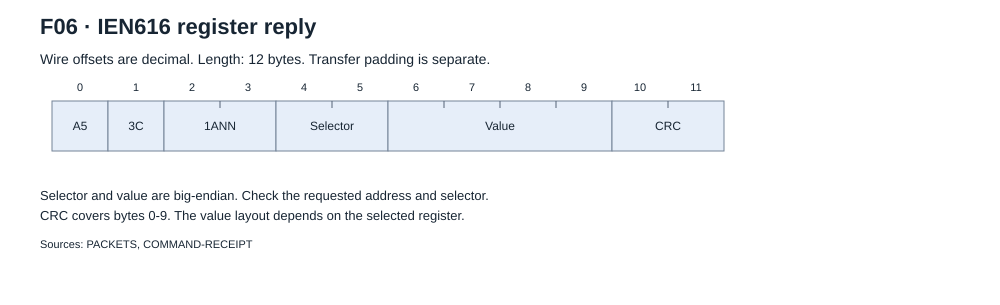
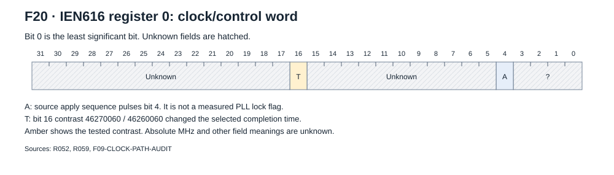
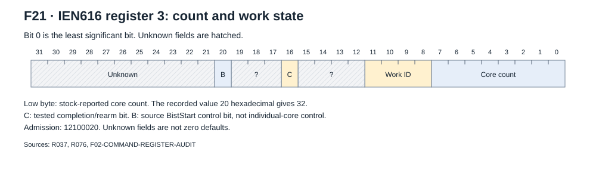
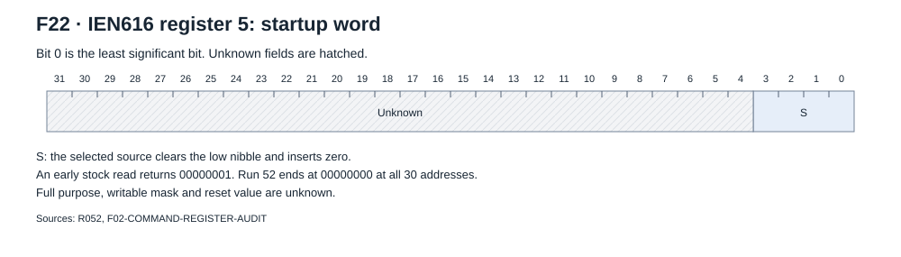
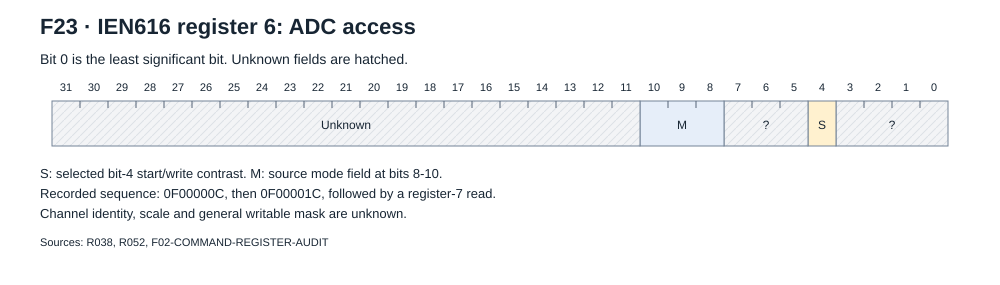
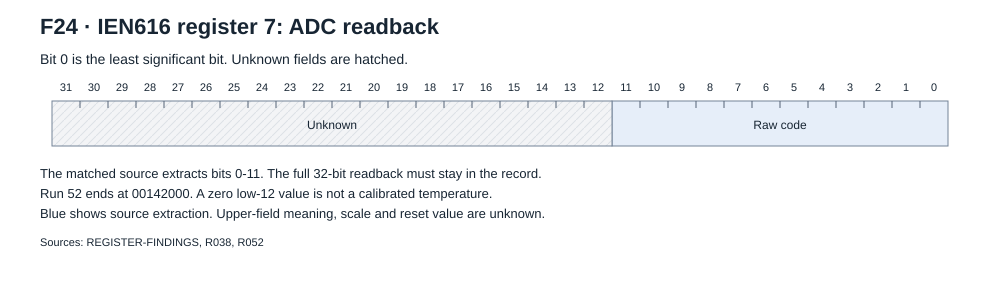
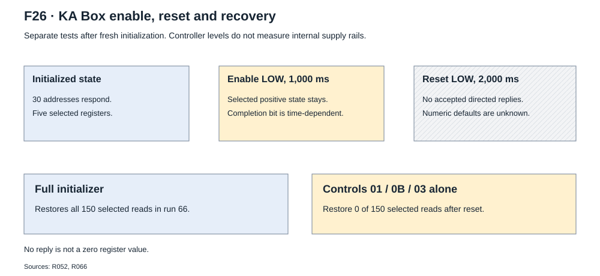

# IEN616 registers

Register access carries a 16-bit selector and a 32-bit big-endian value.
The selected source uses five selectors. No separate individual-core register
interface is supported by the saved evidence.

## Access

```text
Read:   A53C 0ANN SELECTOR_BE[2]
Write:  A53C 09NN SELECTOR_BE[2] VALUE_BE[4] CRC_BE[2]
Reply:  A53C 1ANN SELECTOR_BE[2] VALUE_BE[4] CRC_BE[2]
```

`NN` is the logical address. Address zero selects the recorded broadcast write.
A read request has no CRC. Write and reply CRCs cover bytes 0-9.
See [interfaces](protocol.md#register-write-and-read) for exact examples.



Run 37 supplied 600 directed reads: five selectors, thirty addresses,
two states and repeats. The source census found 54 direct read/write call
sites across these selectors. It does not prove that other silicon registers are absent.

## Register index

| Selector | Recorded use | Direct source reads / writes | Selected initialized value |
| --- | --- | ---: | --- |
| [0x0000](#0x0000-clock-and-control) | Clock/control word | 20 / 10 | `46270060` |
| [0x0003](#0x0003-count-work-and-completion) | Core count, work ID and completion | 5 / 1 | Admission `12100020` |
| [0x0005](#0x0005-startup-word) | Startup word | 2 / 2 | `00000000` |
| [0x0006](#0x0006-adc-access) | Selected ADC access | 6 / 6 | `0F00000C` |
| [0x0007](#0x0007-adc-readback) | Selected ADC readback | 2 / 0 | `00142000` |

The last column gives observations from the tested recipe, not power-on defaults.
Blue fields show a defined source operation or transport field. Amber fields
show selected physical contrasts. Hatched fields have no supported internal meaning.
A known source bit operation does not prove its silicon function.

## 0x0000 Clock and control

**Access:** directed read/write and the recorded broadcast startup sequence.

**Recorded values:** `46270060` at all thirty addresses after run-52 restoration.
The selected contrast word is `46260060`. Latched words `C6270070` and
`C6260070` also occurred. A sent value and a later readback are separate observations.



| Bits | Recorded operation | Evidence and limit |
| --- | --- | --- |
| 4 | Source apply sequence sets and clears the bit. | Tested recipes use the pulse. No PLL lock indication is proved. |
| 16 | Selected `1 → 0 → 1` contrast | Directed readback and relative completion timing were tested. |
| Other bits | Partial source constructors and recorded words | No full physical field definition or safe arbitrary setting. |

**Tested behavior:** run 52 applied `46270060 → 46260060 → 46270060`
at addresses 1 and 20 in separate tests. All 29 other addresses kept the
baseline. Each target returned to the same baseline.
The selected schedule used a 300 ms apply interval, a 50 ms clear wait and
a 20 ms wait after restoration.

Run 59 repeated A/B/A/B/A at address 1 with the same `2^34` work.

| Setting | Mean first-clear time | Comparison |
| --- | ---: | --- |
| A: `46270060` | 538.7753 ms | Three observations |
| B: `46260060` | 552.5979 ms | Two observations |
| B/A | 1.0256557 | Source request ratio: `500 / 487.5 = 1.0256410` |

The slower setting delayed completion by 13.8227 ms on average.
The A spread was 0.8093 ms. The B spread was 0.3395 ms.
All other positions recorded A. The last inventory restored A at all positions.

The relative timing effect is proven for this work and test schedule.
The source interpretation as a hash-rate control is strongly indicated.
Absolute MHz, reference clock, voltage and an unrestricted tuning range stay unknown.

**Source constructor:** the complex setter keeps the bits selected by mask `C000C01F` and
inserts fields at shifts 25, 16, 8 and 5. It then pulses bit 4.
A separate constructor keeps the bits selected by `FE00FC8F` and inserts other caller fields.
These two source paths do not define one physical bit map.

| Firmware request | Selected source output word | Evidence type |
| --- | --- | --- |
| 187.5 MHz | `460E0060` | Original-instruction execution with stubbed register I/O |
| 487.5 MHz | `46260060` | Same offline method. A physical relative contrast exists. |
| 500 MHz | `46270060` | Same offline method. A physical relative contrast exists. |
| 637.5 MHz | `46320060` | Same offline method. The saved stock ramp matches the word. |

These are firmware request values. They are not independent clock measurements.
The selected ramp discards setter failures and can still return success.
The full source audit records that failure path and its limits.

**Reset and restoration:** selected positive state survives enable LOW for
1,000 ms with reset HIGH. Reset LOW for 2,000 ms removes accepted directed
replies. Full initialization restores the tested word. Reset-only defaults are unknown.

**Unknown:** absolute clock, physical reference clock, full writable mask,
lock indication, voltage law and general tuning range.

[Field metadata](figures/register-0.json). Sources: `R052`, `R059`,
`F02-COMMAND-REGISTER-AUDIT` and `F09-CLOCK-PATH-AUDIT`.

## 0x0003 Count, work and completion

**Access:** directed read and selected source writes. The source `BistStart`
path sets or clears bit 20, then sends controls 01, 0B and 03.

**Recorded values:** startup write `12100000`, admission reply `12100020`.
Later work states include `12110620` and `12110F20`.



| Bits | Supported meaning | Limit |
| --- | --- | --- |
| 0-7 | Stock core-count consumer | `20` hexadecimal means 32 reported cores. No physical core anatomy follows. |
| 8-11 | Work-ID field | Recorded values track the assigned work ID in the tested states. |
| 16 | Completion/rearm behavior | Not a pending-result flag or an emitted-result counter. |
| 20 | Source `BistStart` control | Whole logical source or broadcast. No individual-core selector. |
| 12-15, 17-19, 21-31 | Unknown | No assigned internal meaning. |

**Tested behavior:** run 37 associated work-ID changes with the preceding work.
Run 76 tested no-hit, one-hit and four-hit work, then repeated the four-hit work.
Bit 16 started set at each address. It cleared before the drain and stayed
clear through the drain. Replacement work set it again.
The audit found no additional varying counter field in 31,694 matched register-3 reads.

Thirty core-count replies give 960 reported cores. Run 75 returned all core
coordinates from 0 through 31. Neither observation identifies physical lanes.
The source function name `BistStart` does not show an individual-core actuator.

**Reset and restoration:** the initial reply at native row 125 is `12000000`.
The thirty admission replies occur later, at rows 130-159, and contain `12100020`.
Enable-only observations do not isolate bit 16 from elapsed work completion.
Reset removes accepted replies. Full initialization restores admission.

**Unknown:** the internal last-nonce event, other fields and reset-only values.

[Field metadata](figures/register-3.json). Sources: `R037`, `R052`, `R075`,
`R076`, `CORE-CENSUS` and `F02-COMMAND-REGISTER-AUDIT`.

## 0x0005 Startup word

**Access:** directed read and selected read/modify/write path.

**Recorded values:** an early startup read returns `00000001`.
The recipe writes `00000000`. The run-52 final inventory returns `00000000`
at all thirty addresses.



**Source operation:** direct callers supply table keys `20` or `10` hexadecimal.
The selected constructor clears the low nibble and inserts zero.
This source operation does not show the purpose of those bits.

**Tested behavior:** run 37 found stable zero in its two initialized states.
It did not show a universal self-clear or status rule for the earlier value 1.

**Reset and restoration:** full initialization restores the tested zero value.
Run 66 loses all five selected register replies after reset.
There is no readable reset-only default.

**Unknown:** full purpose, writable mask, other bits and behavior before initialization.

[Field metadata](figures/register-5.json). Sources: `R037`, `R052`, `R066`,
`R089-NATIVE` and `F02-COMMAND-REGISTER-AUDIT`.

## 0x0006 ADC access

**Access:** directed read/write in the selected ADC sequence.

**Recorded values:** `0F00000C`, then `0F00001C` in the selected start sequence.



| Bits | Source operation | Limit |
| --- | --- | --- |
| 4 | Selected start/write bit | Physical retention and associated register-7 changes were tested. |
| 8-10 | Clear the field. Set bit 8 for source mode 1. | Channel identity and a general mode map are unknown. |
| Other bits | Unknown | Keep the full recorded word. |

**Tested behavior:** run 38 supplied selected A/B/A mode changes, 180 stable
sample/repeat reads and 60 restorations. Its later warm stock return failed.
The bounded ADC result and failed restoration are separate outcomes.
The source sequence waits 20,000 microseconds after each selected write,
then reads register 7. Full calibrated temperature or voltage does not follow.

**Reset and restoration:** run 52 kept positive ADC state through enable
LOW for 1,000 ms. Reset LOW for 2,000 ms removed accepted addressed replies.
Full initialization returned register 6 to `0F00000C`.

**Unknown:** channel identity, scale, all writable bits and reset-only values.

[Field metadata](figures/register-6.json). Sources: `R038`, `R052`,
`F02-COMMAND-REGISTER-AUDIT` and `F05-HEALTH-CONTROL-AUDIT`.

## 0x0007 ADC readback

**Access:** directed read in the selected source. No direct selected write call
appears in the source census.

**Recorded values:** startup and work observations include `001431xx`.
The run-52 final inventory returns `00142000` at all thirty addresses.



**Source extraction:** the matched consumer uses the low twelve bits as a raw
code. Keep the full 32-bit value in the record. The upper twenty bits have
no assigned function in this reference.

**Tested behavior:** selected register-6 changes produced stable, reversible
register-7 differences. The numerical field is not calibrated safety telemetry.
A low-twelve-bit value of zero is not evidence of cold silicon.

**Reset and restoration:** positive state survived the selected enable-only test.
Reset removed accepted directed replies. Full initialization restored `00142000`.
These states do not give a power-on default.

**Unknown:** sensor placement, calibrated conversion, update interval and upper fields.

[Field metadata](figures/register-7.json). Sources: `REGISTER-FINDINGS`,
`R038`, `R052` and `F05-HEALTH-CONTROL-AUDIT`.

## Reset and recovery scope



The enable and reset contrasts used separate fresh initializers.
The diagram does not define one continuous test sequence.

| Test state | Recorded result | Interpretation limit |
| --- | --- | --- |
| Enable LOW for 1,000 ms, reset HIGH | Selected register 0/6/7 state and work-ID bits stay. | Elapsed work can explain bit-16 changes. |
| Reset LOW for 2,000 ms, enable HIGH | No accepted addressed replies. | No numeric reset values can be read. |
| Controls 01, 0B and 03 after reset | Run 66 restores 0 of 150 selected reads. | These commands do not replace the initializer. |
| Full initializer after reset | Run 66 restores all 150 reads. | Its register writes prevent a reset-default inference. |

No reply is not a zero value. Controller GPIO levels do not measure rail discharge.
Use the full [initialization](initialization.md) and [operation](operation.md) paths.

[Overview](README.md) · [Interfaces](protocol.md) · [Evidence](evidence.md) · [Unknowns](unknowns.md)
