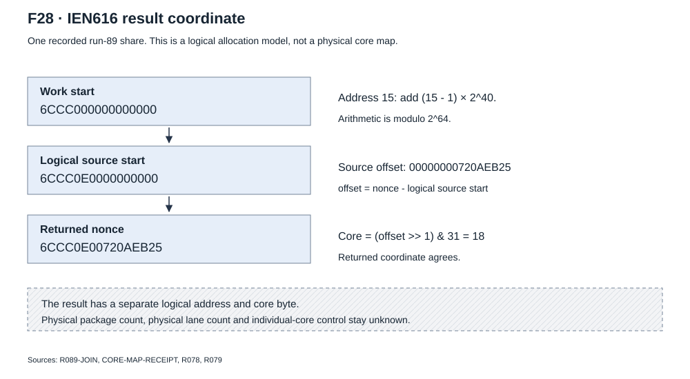
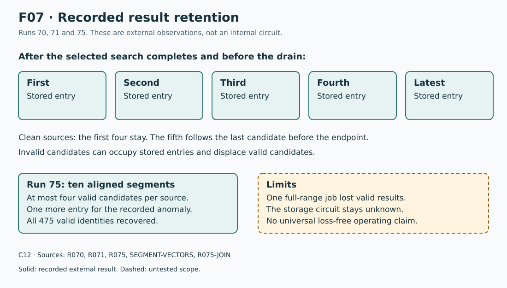

# IEN616 research findings

## Allocation and coordinate model

**C11.** The tested model uses the work start and logical address:

```text
source_start = (work_start + ((address - 1) << 40)) mod 2^64
source_offset = (result_nonce - source_start) mod 2^64
core_coordinate = (source_offset >> 1) & 31
```



F28 applies the model to the first included run-89 accepted share.
The [packet pair](evidence/run89-share-packets.json) keeps the full work and result bytes.

The model describes logical output coordinates. It does not identify packages,
physical lanes or individual-core control.
The [full recorded-corpus extract](evidence/core-map.json) keeps its exceptions.

The audit associated all 33,381 result frames with preceding work in the same
slot. Of 33,371 source-local, in-window frames, 33,370 matched the coordinate rule.
The one in-window mismatch failed the assigned filter. Three out-of-window
coordinate mismatches also failed that filter. Other out-of-window frames stay
in their separate classes. All trailing `ntime_index` bytes were zero.

Runs 43, 44 and 53 changed starts and source coordinates. These contrasts
rejected absolute-coordinate models for the tested inputs.
Runs 64 and 65 showed selected relative timing at three logical result sources.
They did not supply a control that isolates one core under unchanged work.

## Wrap and byte effects

Run 77 distinguished full 64-bit modulo arithmetic from a fixed 48-bit tail.
The selected edge and explicit-wrap cases returned nonce `000004FFF9F5FCDC`
at address 6, core 14. All five frozen result sets matched.
This proves the selected `2^28` wrapped interval and source carry.
It does not prove indefinite cycling or each possible range constructor.

Run 78 changed each encoded range byte separately. The fixed work recorded
its hash, timestamp, filter, slot and width. Result counts were:

```text
baseline / byte0 / byte1 / byte2 / byte3 / byte4 / byte5 / byte6 / byte7 / repeat
       1 /     0 /     0 /     0 /     0 /     0 /     1 /     2 /     0 /      1
```

The source labels byte0-byte7 refer to significance order, from low to high.
They are not the wire offsets in the packet figure.
All ten full predictions and all 8,423 transfers matched the physical record.

Run 79 used result-bearing prefix changes and repeats with unchanged inputs:

| Start | Returned prefix | Result count per case |
| --- | --- | ---: |
| `4A700001D1A097CF` | `4A70` | 1 |
| `4A710001D1A097CF` | `4A71` | 2 |
| `4C700001D1A097CF` | `4C70` | 2 |

The repeats matched. All 5,175 transfers matched passive SPI.
The two returned prefix bytes therefore follow the selected range changes.
Internal routing and arbitrary untested work stay unknown.

## Result service and retention

**C12.** Early narrow tests lost selected outputs without a candidate header.
Longer drains and the run-61 read/no-read/read comparison did not recover them.
Run 61 matched all 2,997 transfers. Early register reads were not the selected
cause of those omissions.

Later broad tests showed a separate service and retention law:

| Run | Controlled difference | Recorded result |
| --- | --- | --- |
| 68 | Filter 33 versus filter 32 | All 241 filter-33 results matched. The two 475-result cases lost 116 and 115 valid results. |
| 69 | Faster result polling | Set equality through 280. All valid predictions through 400. Missing valid results started at 440. |
| 70 | No result polls for 2,500 ms | Five recorded entries per source after completed work. |
| 71 | Change the completed endpoint | All 150 dynamic source observations matched first-four-plus-last predictions. |
| 75 | Ten capacity-limited segments | All 475 valid identities recovered. Four invalid candidates stayed separate. |

Run 69 reduced the median poll interval from about 7.1 ms to 4.859 ms.
For the 475-result case, missing valid results decreased to 34 in each repeat.
The affected sources moved later in the chain service order.
This is a measured service effect, not an unlimited throughput rating.



F07 uses `R070`, `R071` and `R075`. The five boxes represent externally
recorded entries. They do not assert an internal storage circuit.
For clean sources, the first four candidates stay and the fifth follows the
last candidate before the completed endpoint. Invalid candidates can occupy an entry.

## Invalid results and pair boundaries

Run 72 found a nonmonotonic invalid-result pattern across 17 filter settings.
Run 73 showed that the internal ladder points were not deterministic.
The same invalid identity appeared in only some repeats with the same inputs.
No single scalar filter cutoff explained those observations.

Run 74 repeated three endpoint conditions six times each:

| Endpoint relative to the odd invalid nonce | Target present |
| --- | ---: |
| Target minus 2 | 0/6 |
| Target minus 1 | 4/6 |
| Target | 2/6 |

Two-nonce endpoint admission is strongly indicated for this result class.
The host must not accept a nonce outside its intended range.
The driver must keep the raw result and reject invalid PoW.

Across runs 68-74, twelve stable invalid identities appeared 49 times.
All followed the source-relative coordinate rule. Their emission varied.
A valid coordinate and CRC therefore do not show valid PoW.

## Segmented full population

The ten run-75 ranges cover offsets 0 through `2^36 - 1` without overlap.
Each start is divisible by 64. Each end is 63 modulo 64.
Each source has at most four expected valid candidates in a segment.

| Segment | First offset | Last offset | Expected valid results |
| ---: | ---: | ---: | ---: |
| 0 | 0 | 7,502,267,839 | 53 |
| 1 | 7,502,267,840 | 14,174,456,831 | 55 |
| 2 | 14,174,456,832 | 22,702,602,047 | 56 |
| 3 | 22,702,602,048 | 33,304,033,151 | 69 |
| 4 | 33,304,033,152 | 37,555,199,743 | 33 |
| 5 | 37,555,199,744 | 43,849,210,879 | 40 |
| 6 | 43,849,210,880 | 48,927,105,983 | 36 |
| 7 | 48,927,105,984 | 55,802,966,655 | 55 |
| 8 | 55,802,966,656 | 63,228,267,967 | 49 |
| 9 | 63,228,267,968 | 68,719,476,735 | 29 |

The [frozen vectors](evidence/segment-vectors.json) give each packet and expected
identity. The [physical comparison](evidence/segmented-results.json) gives recorded sets,
invalid candidates and all 300 source observations.
All 2,423 transfers matched capture. This result applies to the segmented test.
One unsegmented job did not keep the same full population.

## Replacement, duplicates and remaining questions

Run 65 prepared neither result, A only, B only and both results before replacement.
The tested control/work sequence removed the old pending results in each case.
The restarted work returned A then B. After the drain, replay with the same
inputs returned the same full frames in the same order.

This is a proven replay duplicate class. It is not proof of a general collision
law or internal arbitration rule. The tested same-job source ranges are disjoint.
Full-cycle recurrence lacks a shorter distinguishing control in the selected interface.
Individual-core control and an ASIC-visible emitted-result counter stay open.
The [unknowns page](unknowns.md) gives their reopening conditions.
