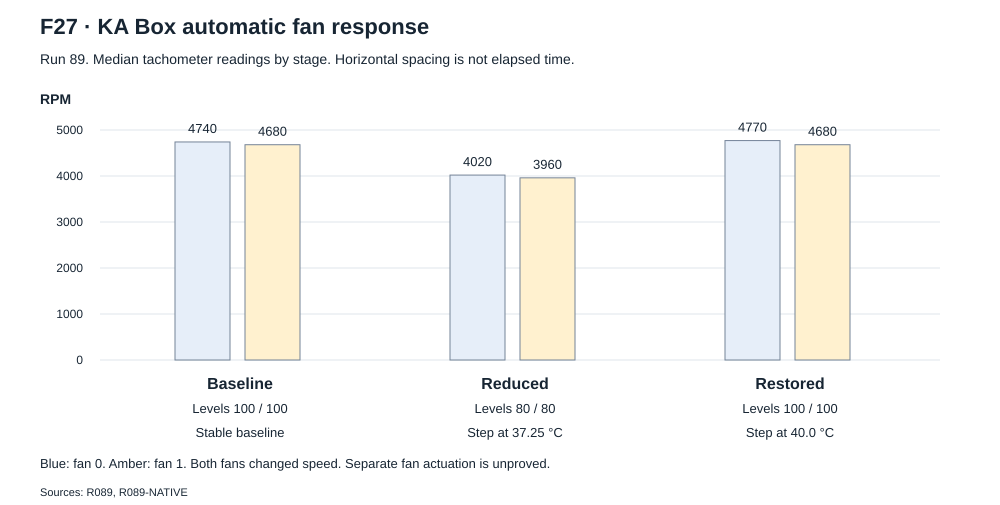

# KA Box stock integration

The IEN616 reference uses one Goldshell KA Box with stock controller and hashboard.
This page records its controller resources, board controls and cooling conditions.
These observations apply to that tested setup.

## Tested platform

| Item | Recorded identity | Evidence |
| --- | --- | --- |
| Controller | `BoxII_CoreBoard V2.0` | C01. Board photographs and cold inspection. |
| Hashboard | `LEP02_ComputeBoard V2` | C01. Board photographs and cold inspection. |
| Installed firmware | Goldshell 2.2.2 | C16. Matched installed and extracted files. |
| Interface population | Thirty logical addresses | C05/C13. Count and admission replies. |

The [hardware page](hardware.md) contains board photographs and capture connections.
The [firmware audit](software.md) identifies the matched software and source limits.

## Controller resources

These paths belong to the tested controller. They are not ASIC pin names.
`READBACK-SOURCE`, `STARTUP-OWNER`, `FULL-CONTROL-OWNER` and `R089-NATIVE`
identify the examined implementation and physical readbacks.

| Resource | Tested interface | Use and limit |
| --- | --- | --- |
| [UART console](hardware.md#j2-uart-console) | J2, `ttyAMA3` | C19. Stock root shell at 115200 baud, 8 data bits, no parity and 1 stop bit. No password prompt. |
| SPI | `/dev/spidev1.0` | Mode 1, 8-bit words. 500 kHz then 1 MHz in the initializer. |
| Enable | `/sys/class/gpio/gpio66/value` | Controller output readback. No measured rail state. |
| Reset | `/sys/class/gpio/gpio67/value` | Tested LOW/HIGH schedule. Package polarity and ratings are unknown. |
| Fan levels | `/sys/class/fans/fan0/lvl`, `/sys/class/fans/fan1/lvl` | Tested levels 100 and 80. Read back both after a change. |
| Fan speed | `/sys/class/fans/fan0/rpm`, `/sys/class/fans/fan1/rpm` | Direct RPM readings for both fans. |
| Board sensor | TMP112, I2C bus 0, address `0x48` | Signed 12-bit conversion. Read errors must fail the health gate. |
| External cutoff | Separate relay watchdog and meter | Independent OFF / 0 W / 0 A observation. |

Ownership checks bind each process to its executable and recorded process
identity. All threads of the four stock controllers must stay stopped.
The independent SPI owner, health reader and cooling controller have separate
responsibilities. The source has no measured independent supply startup path.

## Stock process responsibilities

| Process or component | Selected responsibility | Replacement implication |
| --- | --- | --- |
| `kaspaminer` | SPI, initialization, work, results and selected health reads | Stop all related threads before independent SPI ownership. |
| `minerd` | Management and primary/secondary temperature control | It can write fan levels. |
| `fanctrl` | Thermal protection, fan forcing and selected supply-disable calls | Independent operation must have its own cooling and cutoff path. |
| `xminerd` | Supervisor and lifecycle control | Its selected powerdown helper is a no-op in the matched library. |
| `libminer.so.1.0.0` | Device, fan, sensor and supply helpers | An exported function is not proof that the selected startup path calls it. |
| Controller startup configuration | Separate process restart rules | Process exit alone does not guarantee lasting exclusive ownership. |

Run 46 stopped the miner and manager but recorded stock fan protection.
Runs 81 and 89 stopped all four stock controllers after stock preparation.
Run 89 demonstrated independent cooling during mining.

## Ownership and admission

1. Complete stock preparation before independent initialization.
2. Stop the four identified stock control processes and their threads.
3. Start the selected independent cooling owner and separate relay watchdog.
4. Check direct board health and exclusive SPI ownership.
5. Complete the [initializer](initialization.md) and its thirty admission checks.

The [operation page](operation.md#ownership-and-tested-operating-state) defines the health gates and failure actions.
The [task procedures](procedures.md) give the selected command and sensor checks.

## Power and reset

Stock software prepares the supply before independent control.
The independent supply startup sequence has no measurement record.
GPIO 66 and 67 are controller enable and reset outputs. Their readbacks do not measure rail state.
Configured supply GPIOs 14, 45 and 50 lack a measured rail map.

The tested reset/enable schedule is in
[initialization](initialization.md#ordered-native-recipe).
The [register reference](registers.md#reset-and-recovery-scope) gives the separate reset and enable observations.
A controller GPIO name does not identify an ASIC package pin or electrical rating.

## Two-fan control

Run 83 wrote only one logical fan level at a time. The other readback stayed
100, but the two tachometers decreased by about 15 percent.
Restoration of both levels to 100 recovered both fan speeds.
Shared control is strongly indicated. Separate physical fan actuation stays unproved.

Run 89 tested automatic two-fan control during independent mining:

| Stage | Direct temperature | Logical levels | Tachometer medians |
| --- | ---: | --- | --- |
| Stable baseline | Before the reduction | `[100,100]` | 4,740 / 4,680 RPM |
| Automatic reduction | 37.25 °C | `[80,80]` | 4,020 / 3,960 RPM after more than 2 seconds |
| Automatic restoration | 40.0 °C | `[100,100]` | 4,770 / 4,680 RPM |

F27 shows the three recorded medians from `R089`. It is a comparison by stage,
not a continuous time trace. Separate fan actuation is unproved.

The first baseline used two distinct frames more than 0.75 seconds apart.
Each tachometer reading was more than 4,300 RPM and changed less than 5 percent.
Initial spinup samples did not enter that baseline.

The reduced-speed medians decreased 15.19 and 15.38 percent.
The restored medians were within 0.63 and 0 percent of baseline.
All 126 status queries and 126 cooling leases passed.
The active board samples ranged from 35.8125 to 45.0625 °C.
The initial spinup minimum was 1,860 RPM.

The last direct POST readings occur after the active interval.
They are separate values in [the control extract](evidence/run89-control.json).
These observations prove the specified cycle. They do not qualify a general
thermal policy, changed ambient conditions or calibrated junction temperature.

## Stop and stock return

The [Stop sequence](operation.md#stop-power-cutoff-and-stock-return) records owner release and enable/reset LOW readbacks.
It also records fan restoration and the separate OFF / 0 W / 0 A check.
This state does not prove internal rail discharge.
The later cold stock return is a separate test. General warm stock return is unproved.

## Evidence boundary

Sources: `COLD`, `CONTACTS`, `READBACK-SOURCE`, `STARTUP-OWNER`,
`FULL-CONTROL-OWNER`, `R083`, `R089` and `R090`.
These records support the tested KA Box integration. They do not qualify a new IEN616 board.
Keep board temperature limits, fan levels and controller paths with this platform.
Chip pin functions, rail ratings and calibrated junction temperature are unknown.
